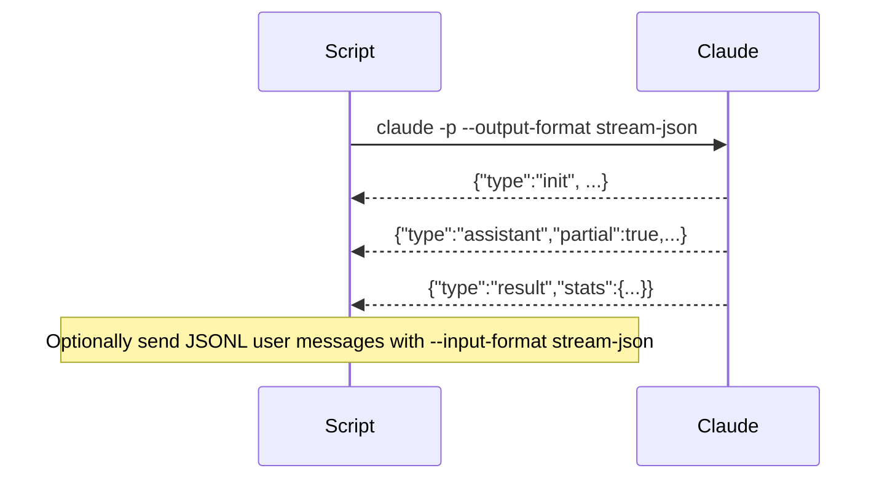

# Claude Code – Comprehensive Functionality Spec (v0.1)

> **Scope:** A product-level specification of Claude Code’s capabilities (CLI, interactive terminal, permissions/modes, slash commands, subagents, MCP/tooling, SDK/headless/streaming, terminal behavior, web search, and workflow patterns). This is written as a reverse‑indexable reference for the KyleCode project.

---

## Table of Contents

1. [Product Overview](#product-overview)
2. [Installation & Setup](#installation--setup)
3. [Core Concepts](#core-concepts)
4. [CLI: Commands & Flags](#cli-commands--flags)
5. [Interactive Mode (REPL)](#interactive-mode-repl)
6. [Permission Modes & Safety Model](#permission-modes--safety-model)
7. [Slash Commands](#slash-commands)
8. [Subagents](#subagents)
9. [Built‑in Tools (Core) & Web](#built-in-tools-core--web)
10. [Model Context Protocol (MCP)](#model-context-protocol-mcp)
11. [Project Memory: `CLAUDE.md` & Status Line](#project-memory-claudemd--status-line)
12. [SDKs & Headless Usage](#sdks--headless-usage)
13. [Session State, Context, & Compaction](#session-state-context--compaction)
14. [Terminal UX & Behaviors](#terminal-ux--behaviors)
15. [CI/CD & Deployment](#cicd--deployment)
16. [Admin, IAM & Data Usage](#admin-iam--data-usage)
17. [Troubleshooting & Diagnostics](#troubleshooting--diagnostics)
18. [Security Model & Hardening](#security-model--hardening)
19. [Patterns & Workflows](#patterns--workflows)
20. [Appendix A: Full CLI & Slash Command Index](#appendix-a-full-cli--slash-command-index)
21. [Appendix B: Tool Catalog (Core + SDK Exposed)](#appendix-b-tool-catalog-core--sdk-exposed)
22. [Appendix C: Diagrams](#appendix-c-diagrams)

---

## Product Overview

Claude Code is Anthropic’s terminal‑first, agentic coding environment. It combines:

- An interactive REPL (chat‑like) with code‑aware tools (read/edit/grep/glob/bash/git, etc.)
- A permissioned agent harness supporting explicit approval, plan‑first, and auto‑accept flows
- Extensibility via MCP (Model Context Protocol) for hundreds of third‑party tool servers
- Project memory via `CLAUDE.md` (and additional memory files) + configurable status line
- SDKs (TypeScript/Python) and headless/streaming interfaces for embedding into workflows

**Primary goals**: fast coding loops, safe execution, reproducibility, and composable automation.

---

## Installation & Setup

- **Distributions**: npm install, native installers, package managers.
- **Login**: `claude login` → browser/OAuth; `claude logout` to revoke.
- **Project bootstrap**: `/init` to scaffold `CLAUDE.md`, `.claude/` with `settings.json`, commands, agents.
- **Model selection**: global or per‑project via settings; override with `--model` on invocation.
- **Terminal configuration**: `/terminal-setup` to install Shift+Enter newline bindings (iTerm2/VSCode).

---

## Core Concepts

- **Agent Harness**: runs multi‑turn plans, delegates to tools, respects permission mode, logs results.
- **Permission Modes**: *default*, *plan*, *acceptEdits*, and an explicit *bypass/skip* mode for sandboxed use.
- **Tools**: first‑class operations (Bash, Read/Edit/MultiEdit, Grep/Glob, WebFetch/WebSearch, TodoWrite, etc.).
- **Subagents**: specialized task agents with their own prompt, tools, and optional model.
- **Memory**: `CLAUDE.md` and friends provide persistent project context and guardrails.
- **MCP**: connect external services and resources via stdio/HTTP/SSE servers.

---

## CLI: Commands & Flags

### Common commands

- `claude` → start REPL
- `claude "query"` → start REPL pre‑seeded with an initial user message
- `claude -p "query"` → headless (print mode) one‑shot
- piping: `cat foo | claude -p "explain"`
- sessions: `claude --continue`, `claude --resume <id>`
- update: `claude update`
- MCP: `claude mcp ...`

### Notable flags

- `--model <alias|full>` (e.g., `sonnet`, `opus`, full model string)
- `--permission-mode <default|plan|acceptEdits|bypassPermissions>`
- `--allowedTools`, `--disallowedTools` (exact tool names or patterns)
- `--print|-p` with `--output-format <text|json|stream-json>` and `--input-format <text|stream-json>`
- `--include-partial-messages` (with streaming JSON)
- `--append-system-prompt` (print‑mode only)
- `--continue|-c`, `--resume|-r <id>`
- `--permission-prompt-tool <mcp_tool>` (delegate approvals in headless flows)
- `--dangerously-skip-permissions` (for locked‑down sandboxes)
- `--verbose`

> See **Appendix A** for a complete matrix of commands/flags and examples.

---

## Interactive Mode (REPL)

**Shortcuts & controls**
- General: `Ctrl+C` cancel, `Ctrl+D` exit, `Ctrl+L` clear, ↑/↓ history, `Esc Esc` edit previous.
- Multiline: backslash+Enter, Option+Enter (macOS), `/terminal-setup` for Shift+Enter, `Ctrl+J`.
- Quick prefixes: `#` (add to memory), `/` (slash command), `!` (run bash directly, log output in context).
- Vim mode: `/vim` to toggle; NORMAL mode navigation/editing (`h/j/k/l`, `dd`, `cw`, etc.).

**Backgrounding**
- Long‑running Bash can be backgrounded; `Ctrl+B` moves running Bash to background (tmux: press twice).
- Each background task gets an ID; output is buffered and retrievable.

**Bash‑prefix mode**
- `! <cmd>` runs without model mediation; command + output are still added to the transcript.

---

## Permission Modes & Safety Model

- **default**: prompt for permission on first use of a tool/action.
- **plan**: read‑only analysis and planning; model proposes steps, no edits/exec without approval.
- **acceptEdits**: auto‑approve edits (and optionally other tools) for faster loops in trusted repos.
- **bypass/skip**: fully skip prompts (use only in tightly sandboxed, non‑sensitive envs).

**Mode switching**
- Interactive toggle: **Shift+Tab** cycles modes; status line reflects the current mode.
- CLI: `--permission-mode plan` etc.; project/user defaults via `.claude/settings.json`.

**Permissions lists**
- Define `allowedTools` / `disallowedTools`; wildcard patterns supported (e.g., `Bash(git log:*)`).
- Hierarchy: enterprise managed → project → local/project → user.

---

## Slash Commands

**Built‑ins (selection)**
- `/add-dir`, `/agents`, `/bug`, `/clear`, `/compact [instructions]`, `/config`, `/cost`, `/doctor`, `/help`, `/init`, `/login`, `/logout`, `/mcp`, `/memory`, `/model`, `/permissions`, `/pr_comments`, `/review`, `/status`, `/terminal-setup`, `/vim`.

**Custom slash commands**
- Markdown in `.claude/commands/` (project) or `~/.claude/commands/` (personal); supports arguments, namespacing, frontmatter, thinking mode hints, file refs, and Bash execution blocks.

**MCP slash commands**
- Expose MCP prompts as slash commands; dynamic discovery and permission scoping.

---

## Subagents

- **Definition**: Markdown files with YAML frontmatter: `name`, `description`, optional `tools`, optional `model`.
- **Storage**: `.claude/agents/` (project) and `~/.claude/agents/` (user). Project overrides user on name collision.
- **Invocation**: automatic delegation by intent; explicit via natural language (“use the debugger subagent…”); `/agents` TUI to create/manage.
- **Best practices**: separate concerns (reviewer/debugger/test‑runner/data‑scientist), minimal tools, clear “proactively use” semantics, inherit model unless specialty required.

---

## Built‑in Tools (Core) & Web

**Core tools (high level)**
- *Task* (scaffolds plan steps and sub‑tasks)
- *Read*, *Write*, *Edit*, *MultiEdit*, *Glob*, *Grep*
- *Bash*, *BashOutput*, *KillBash*
- *NotebookEdit*
- *TodoWrite* (maintain an internal todo list visible to the agent)
- *WebFetch*, *WebSearch* (fetch and search the web when enabled)
- *ListMcpResources*, *ReadMcpResource*
- *ExitPlanMode*

**Web usage**
- Web tools are permissioned; can be allowed/blocked. Prompt‑injection defenses rely on harness reminders + strict URL policies. Prefer MCP servers for structured APIs when possible.

---

## Model Context Protocol (MCP)

- **Transports**: stdio (local), HTTP, SSE (remote). Add servers with `claude mcp add`.
- **Scopes**: local (current process), project, user; precedence: project > user.
- **Resources & Prompts**: expose “resources” (readable context) and parameterized prompts; can be wired into slash commands.
- **Popular servers**: Sentry, Linear, Notion, GitHub, Box, Vercel, Stripe, Figma Dev Mode, Zapier, etc.
- **Auth**: built‑in flows for remote servers; can import from Claude Desktop; env var expansion supported in `.mcp.json`.

---

## Project Memory: `CLAUDE.md` & Status Line

- **Memory files**: `CLAUDE.md` (+ optional per‑dir files) for durable guidance, conventions, and constraints.
- **Status line**: configurable; can show mode, model, cost, server connections, etc.
- **Shortcuts**: `#` at input start to add items to memory quickly.

---

## SDKs & Headless Usage

- **TypeScript/Python SDKs** expose: `query()`, `tool()`, streaming events, message types, permission hooks, MCP helpers, and the full tool catalog (including WebSearch/WebFetch and TodoWrite).
- **Headless**: `-p` non‑interactive with `--output-format json|stream-json`; supports **streaming JSON** (init → partials → result). `--input-format stream-json` accepts JSONL user messages for multi‑turn streams.
- **Delegated approvals**: `--permission-prompt-tool <mcp_tool>` to programmatically approve/deny in headless runs.

---

## Session State, Context, & Compaction

- The harness tracks sessions per working directory; `--continue` / `--resume <id>`.
- Automatic summarization/compaction maintains context window budget.
- Title/topic detection and small “system reminders” keep threads on task.
- Internal todo lists can be proactively suggested/maintained via `TodoWrite`.

---

## Terminal UX & Behaviors

- Live incremental streaming of assistant output; inline diffs for edits; permission dialogs with diff previews.
- Background task panel (IDs, status, tail output retrieval).
- Smooth scrolling UI; colorized statuses; mode badge (normal/plan/auto‑accept).
- `Ctrl+L` preserves transcript; `/compact` to shrink conversation with optional focus instructions.

---

## CI/CD & Deployment

- **GitHub Actions/GitLab**: official guides; use headless CLI + JSON output + `--allowedTools`.
- **LLM Gateway**: route via proxy for logging/cost metrics and key management.
- **Dev containers**: recommended for `--dangerously-skip-permissions` scenarios.

---

## Admin, IAM & Data Usage

- Enterprise installation, managed settings (`managed-settings.json`) and policy enforcement.
- IAM config for auth/refresh; data usage policies and analytics hooks.

---

## Troubleshooting & Diagnostics

- `/doctor` health checks; `/status` account/model/server diagnostics; `--verbose` for turn-by-turn traces.
- MCP output limits warnings; web fetch limits; permission denials with reasons.

---

## Security Model & Hardening

- Prefer *plan* mode in unknown repos; keep *acceptEdits* to trusted workspaces.
- Scope tool permissions; disallow wildcard Bash by default; favor MCP over arbitrary web fetch.
- Run in containers with reduced privileges for auto‑approval or skip‑permissions workflows.

---

## Patterns & Workflows

- **Exploration → Plan → Execute**: start in *plan*, switch to *acceptEdits* when confident; `/review` and `/pr_comments` for code review loops.
- **Delegate with Subagents**: reviewer, debugger, test‑runner, data‑scientist; chain via natural language.
- **Web‑assisted coding**: enable WebSearch in plan mode; capture citations/resources via memory.
- **Headless automation**: JSON/streaming JSON; delegated approvals; cost tracking and logs.

---

## Appendix A: Full CLI & Slash Command Index

### CLI (selected + examples)
- `claude` | `claude "query"` | `claude -p` | `--continue` | `--resume <id>` | `--model <name>` | `--permission-mode <mode>` | `--allowedTools` | `--disallowedTools` | `--output-format <text|json|stream-json>` | `--input-format stream-json` | `--include-partial-messages` | `--append-system-prompt` | `--permission-prompt-tool <mcp_tool>` | `--dangerously-skip-permissions` | `--verbose` | `update` | `mcp ...`

### Slash commands (built‑in)
- `/add-dir` · `/agents` · `/bug` · `/clear` · `/compact` · `/config` · `/cost` · `/doctor` · `/help` · `/init` · `/login` · `/logout` · `/mcp` · `/memory` · `/model` · `/permissions` · `/pr_comments` · `/review` · `/status` · `/terminal-setup` · `/vim`

---

## Appendix B: Tool Catalog (Core + SDK Exposed)

- **Task** – structure steps, sub‑goals, plan scaffolding.
- **Read / Write / Edit / MultiEdit** – file IO and batched diffs.
- **Glob / Grep** – file discovery and search.
- **Bash / BashOutput / KillBash** – shell commands; backgroundable; output persistence.
- **NotebookEdit** – notebook cells modifications.
- **WebFetch / WebSearch** – HTTP fetch and search (when enabled).
- **TodoWrite** – maintain internal todo list for steering.
- **ListMcpResources / ReadMcpResource** – enumerate and pull MCP resources.
- **ExitPlanMode** – explicit exit of plan mode from within flows.

---

## Appendix C: Diagrams

### Claude Code High‑Level Architecture
```mermaid
flowchart LR
  User[[Terminal / IDE]] -->|REPL input| Harness(Agent Harness)
  subgraph Harness
    PM[Permission Mode
    default / plan / acceptEdits
    skip-permissions]
    Tools[Core Tools
    (Read/Edit/Bash/Web/...)]
    MCP[MCP Client]
    Mem[Memory (CLAUDE.md)]
    Ctx[Session & Compaction]
  end
  Harness --> SDKs[SDK / Headless / Streaming JSON]
  MCP --> Ext[External MCP Servers]
  Tools --> FS[(Project Files)]
  Tools --> Shell[(Local Shell)]
  Tools --> Web[(Web Fetch / Search)]
  Ext -->|Resources/Prompts| Harness
```

### Permission Modes & Flow
```mermaid
stateDiagram-v2
  [*] --> Default
  Default --> Plan: Shift+Tab / --permission-mode plan
  Default --> AcceptEdits: Shift+Tab / --permission-mode acceptEdits
  Plan --> Default: approve / ExitPlanMode
  AcceptEdits --> Default: toggle / settings
  Default --> Bypass: --dangerously-skip-permissions
  Bypass --> Default: restart in safer mode
```

### Headless Streaming (JSONL)


