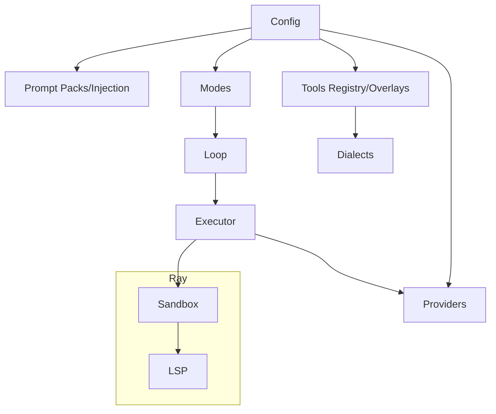
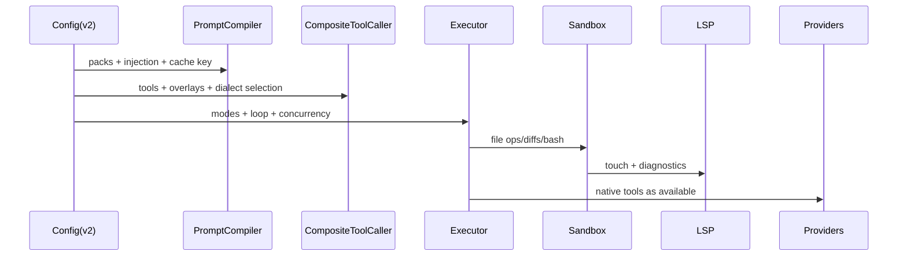

### Agent Schema V2 Specification

This document specifies the RayCoder Agent Schema v2, synthesizing the attached V2 report (and relevant V1 elements). It defines config structure, semantics, defaults, and the runtime mapping across prompts, tools, dialects, providers, modes, subagents, concurrency, completion, HPO/RL, and telemetry.

### Table of Contents
- [Goals and Principles](#goals-and-principles)
- [Top-level Structure](#top-level-structure)
- [Workspace and LSP](#workspace-and-lsp)
- [Providers and Adapters](#providers-and-adapters)
- [Prompts: Packs, Injection, Caching, Evolution](#prompts-packs-injection-caching-evolution)
- [Tools: Registry, Overlays, Aliases, Dialects](#tools-registry-overlays-aliases-dialects)
- [Modes and Mode Families](#modes-and-mode-families)
- [Loop: Sequence, Turn Strategy](#loop-sequence-turn-strategy)
- [Concurrency and Guards](#concurrency-and-guards)
- [Completion and Exit Arbitration](#completion-and-exit-arbitration)
- [HPO, RL and Prompt Evolution](#hpo-rl-and-prompt-evolution)
- [Telemetry](#telemetry)
- [Runtime Mapping to Code](#runtime-mapping-to-code)
- [Validation Rules and Defaults](#validation-rules-and-defaults)
- [Mermaid Diagrams](#mermaid-diagrams)

### Goals and Principles
- Modular, provider-agnostic agent config that can clone modern IDE agent workflows (Cline Deep Plan, Copilot Agent Mode, OpenCode, Augment).
- Two-track tools: provider-native schemas and text dialects co-exist with model-aware selection and fallbacks.
- Deterministic prompt injection with cache keys for reproducibility and low churn.
- First-class planning modes and subagents; isolation via Ray + optional gVisor runtime.

### Top-level Structure
Minimal skeleton:

```yaml
version: 2
profile:
  name: "default"
  description: "maximally modular agent coder"
  seed: 42

workspace:
  root: ./agent_ws
  sandbox: { driver: docker, runtime: runsc, image: gcc-dev:latest, network: none, resources: { cpus: 2, mem_gb: 8 } }
  lsp: { enabled: true, diagnostics_on_write: true, servers: [pyright, clangd, tsserver] }
  mirror:
    enabled: true
    path: ./agent_ws
    mode: development  # development|testing|production

providers:
  default_model: openrouter/openai/gpt-5-nano
  models:
    - id: openrouter/openai/gpt-5-nano
      adapter: openai
      params: { temperature: 0.2, parallel_tools: true, structured_outputs: {enabled: true, strict: true} }
    - id: anthropic/claude-3-7-sonnet
      adapter: anthropic
      params: { tool_use: true }

prompts:
  packs: { base: { system: implementations/system_prompts/default.md, plan: implementations/system_prompts/claude_code/plan.md, builder: implementations/system_prompts/default.md, compact: implementations/system_prompts/default.md, tools_catalog_full: implementations/system_prompts/default.md, tools_catalog_short: implementations/system_prompts/default.md } }
  injection: { system_order: ["@pack(base).system", "[CACHE] @pack(base).tools_catalog_full"], per_turn_order: ["mode_specific", "@pack(base).tools_catalog_short"] }
  cache: { enabled: true, key: "sha256(config+prompts+toolset)" }
  evolution: { enabled: false, store_dir: ./implementations/prompt_evolution }

tools:
  registry: { paths: [implementations/tools/defs], include: ["*"] }
  overlays: []
  aliases: { patch: "apply_unified_patch", edit: "apply_search_replace" }
  dialects:
    preference:
      default: [unified_diff, aider_search_replace, opencode_patch, bash_block]
      by_model:
        "openrouter/openai/*": { native: true, order: [yaml_command, unified_diff, opencode_patch] }
        "anthropic/*": { order: [aider_search_replace, unified_diff] }
      by_tool_kind:
        diff: [unified_diff, aider_search_replace, opencode_patch]
        bash: [bash_block, provider_native]
    selection:
      by_model: { "openrouter/openai/*": [unified_diff, opencode_patch], "anthropic/*": [aider_search_replace, unified_diff] }
      by_tool_kind: { diff: [unified_diff, aider_search_replace, opencode_patch], bash: [bash_block, provider_native] }
    create_file_policy: { unified_diff: { header_style: git, use_dev_null: true }, aider_search_replace: { prefer_write_file_tool: true } }

modes:
  - name: deep_plan
    prompt: "@pack(base).deep_plan"
    tools_enabled: [read_file, list_dir, glob, grep]
    tools_disabled: [apply_unified_patch, apply_search_replace, run_shell]
    outputs: { plan_file: PLAN.md, tasks_file: TASKS.md }
    exit: { when: [plan_is_ready, user_approved] }
  - name: plan
    prompt: "@pack(base).plan"
    tools_enabled: [read_file, list_dir, glob, grep]
  - name: build
    prompt: "@pack(base).builder"
    tools_enabled: ["*"]
    subagents:
      enabled: true
      supervisor: hierarchical
      agents:
        - name: unit_tests
          model: openrouter/openai/gpt-5-nano
          tools: [run_shell, read_file]
          workspace: shared
          budget: { max_tokens: 4000 }
        - name: linter
          model: anthropic/claude-3-7-sonnet
          tools: [apply_unified_patch, read_file]
  - name: compact
    prompt: "@pack(base).compact"
    tools_enabled: []
    triggers: { tokens_remaining_pct_lt: 20 }

loop:
  sequence:
    - if: "features.deep_plan"
      then: { mode: deep_plan }
    - if: "features.plan"
      then: { mode: plan }
    - mode: build
    - while: "needs_compact"
      do: { mode: compact }
  turn_strategy: { relay: tool_role, flow: assistant_continuation, tool_result_injection: summarize }

concurrency:
  groups:
    - { name: fs_reads, match_tools: [read_file, glob, grep, list_dir], max_parallel: 4 }
    - { name: edits_and_bash, match_tools: [apply_unified_patch, apply_search_replace, run_shell], max_parallel: 1, barrier_after: apply_unified_patch }
  nonblocking_tools: [read_file, glob, grep, list_dir]
  at_most_one_of: [run_shell]

completion:
  primary: hybrid
  tool_finish: mark_task_complete
  natural_finish: { no_tool_turns_threshold: 2, idle_turn_limit: 1 }
  provider_signals: true
  text_sentinels: ["TASK COMPLETE","ALL TESTS PASSED","IMPLEMENTATION COMPLETE", ">>>>>> END RESPONSE"]
  confidence_threshold: 0.6

hpo:
  enabled: false
  objective: episode_return
  wandb: { project: raycoder, entity: your_team, mode: online }
  search: { algorithm: bayes-hyperband, max_runs: 200 }
  params: {}

rl_and_evolution:
  prompt_evolver: { enabled: false }
  policy_rl: { enabled: false }

telemetry:
  database_path: ./perf/enhanced_tool_calling.db
  per_turn_metrics: [SVS, ACS, CPS, PAS, HMR, LED, SBS, TPF_DELTA, TE, LE, TOE, SPA]
```

### Workspace and LSP
- `sandbox.driver`: docker | process. If docker, prefer `runtime: runsc` (gVisor). Network default `none`.
- `lsp.enabled`: toggles LSP integration; when true, write/edit touch triggers diagnostics refresh.

### Providers and Adapters
- `adapter`: openai | anthropic | gemini | ...
- `params.parallel_tools`: exploit provider parallel function/tool calls.
- `params.structured_outputs.strict`: enforce JSON schema strictness (OpenAI).

### Prompts: Packs, Injection, Caching, Evolution
- `packs.*`: file pointers for system/plan/deep_plan/builder/compact and catalogs.
- `injection.system_order` and `per_turn_order`: deterministic ordered insertion, with `[CACHE]` items hashed.
- `evolution`: store directory and mutation policy for prompt evolver.

### Tools: Registry, Overlays, Aliases, Dialects
- `registry.paths`: directories with YAML tool specs; `include` filters.
- `overlays`: rename tools, override descriptions, set syntax style, provider preferences; non-destructive to base YAMLs.
- `aliases`: friendly names to real tool ids.
- `dialects.preference`: declarative ordering for provider-native vs text formats (supports `native: true/false`, wildcarded model patterns, and per-tool-kind overrides).
- `dialects.selection`: legacy/compatibility hints that continue to influence text-dialect ordering.
- `create_file_policy`: normalize add-file semantics per dialect.

### Modes and Mode Families
- `deep_plan`: Cline-style deep planning (read-only, outputs plan/tasks files, gated exit conditions).
- `plan`: OpenCode Plan Agent analogue (read-only plan).
- `build`: all tools allowed, optional subagents with `supervisor` policy and budgets; workspace isolation per agent.
- `compact`: summarization mode; triggered when tokens low.

### Loop: Sequence, Turn Strategy
- `sequence`: mode program with conditions and loops.
- `turn_strategy.relay`: tool_role vs user_message; `flow`: assistant_continuation vs interleaved; `tool_result_injection`: summarize/full/none.

### Concurrency and Guards
- `groups`: parallelize safe reads; serialize diffs/bash; allow barriers after specific tools.
- `nonblocking_tools`: list for concurrent execution; `at_most_one_of`: mutually exclusive set per turn.

### Completion and Exit Arbitration
- Arbitrates across explicit tool (`mark_task_complete`), provider finish reasons, text sentinels, and natural stop heuristics.

### HPO, RL and Prompt Evolution
- HPO knobs for sweeps (Bayesian Hyperband); prompt evolver with mutators and protected sections; optional RL policy training.

### Telemetry
- Per-turn metrics aligned with current reward model; persisted at `telemetry.database_path`.

### Runtime Mapping to Code
- Prompt compiler maps `prompts.*` to `agentic_coder_prototype/compilation/system_prompt_compiler.py` and caches by content hash.
- Tool registry overlays feed `compilation/tool_yaml_loader.py` to build catalog and provider-native schemas via `provider_adapters.py`.
- Dialect selection integrates with `execution/dialect_manager.py` and `CompositeToolCaller` to parse/execute.
- Subagents and isolation are composed via `kylecode/sandbox_v2.py` and LSP enhancements in `kylecode/sandbox_lsp_integration.py`.
- Concurrency/policies are enforced by the executor/turn scheduler; completion arbitrated by `state/completion_detector.py`.

### Validation Rules and Defaults
- Required: `version`, `workspace`, `providers.default_model`, `providers.models[].id+adapter`, at least one `mode` and `loop.sequence` item.
- Defaults: when unspecified, reasonable safe defaults from the skeleton above apply.

### Mermaid Diagrams






