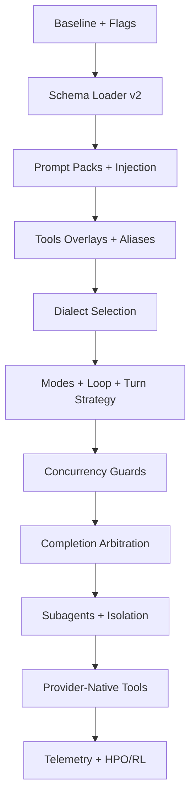

### Agent Schema V2 Port Plan

This document is a concrete action plan to implement the v2 schema across the codebase, starting from abstractions to complete agent integration.

### Table of Contents
- [Objectives and Success Criteria](#objectives-and-success-criteria)
- [Milestone 0: Baseline and Flags](#milestone-0-baseline-and-flags)
- [Milestone 1: Schema Loader and Validation](#milestone-1-schema-loader-and-validation)
- [Milestone 2: Prompt Packs and Injection](#milestone-2-prompt-packs-and-injection)
- [Milestone 3: Tools Registry Overlays and Aliases](#milestone-3-tools-registry-overlays-and-aliases)
- [Milestone 4: Dialect Selection and Fallback Policy](#milestone-4-dialect-selection-and-fallback-policy)
- [Milestone 5: Modes, Loop, and Turn Strategy](#milestone-5-modes-loop-and-turn-strategy)
- [Milestone 6: Concurrency Guards](#milestone-6-concurrency-guards)
- [Milestone 7: Completion Arbitration](#milestone-7-completion-arbitration)
- [Milestone 8: Subagents and Isolation](#milestone-8-subagents-and-isolation)
- [Milestone 9: Provider-Native Tools Integration](#milestone-9-provider-native-tools-integration)
- [Milestone 10: Telemetry + HPO/RL Integration](#milestone-10-telemetry--hporl-integration)
- [Validation, Tests, and De-risking](#validation-tests-and-de-risking)
- [Mermaid Roadmap](#mermaid-roadmap)

### Objectives and Success Criteria
- Adopt v2 schema without breaking current runs; v1 configs can co-exist until migration complete.
- Reproducible prompts via cache keys; deterministic tool menus per mode; safe concurrency; reliable exit.
- Reference profiles run: `cline_deep_plan_v2.yaml`, `opencode_compat_v2.yaml`, `copilot_agent_mode_v2.yaml`.

### Milestone 0: Baseline and Flags
- Add feature flags: `AGENT_SCHEMA_V2_ENABLED`, per-run override to select loader v1 vs v2.
- Wire CLI to accept v2 YAML and route to v2 loader.

### Milestone 1: Schema Loader and Validation
- Create `agentic_coder_prototype/compilation/v2_loader.py`:
  - Parse YAML; resolve `extends: base_v2.yaml` (shallow merge with array-aware semantics: replace arrays unless explicitly `+merge`).
  - Validate required fields; apply defaults from spec.
  - Materialize computed structures: prompt pack paths, overlay maps, dialect selection tables.
- Deliverables: loader, JSON-Schema contract for v2 (optional), unit tests.

### Milestone 2: Prompt Packs and Injection
- Extend `system_prompt_compiler` to:
  - Accept v2 `prompts.packs` and `injection` orders.
  - Compute cache key `sha256(config+prompts+toolset)`; persist compiled prompts.
  - Support `mode_specific` inserts and per-turn short catalog.
- Unit tests with pack switching and cache hits.

### Milestone 3: Tools Registry Overlays and Aliases
- Extend `tool_yaml_loader.py`:
  - Load registries from `paths`; filter by `include`.
  - Apply `overlays` (rename, description, syntax_style, provider_preference) without editing base YAML.
  - Expose `aliases` mapping.
- Update `provider_adapters.py` to compile provider-native schemas from the overlaid catalog.

### Milestone 4: Dialect Selection and Fallback Policy
- Enhance `execution/dialect_manager.py`:
  - Add `selection.by_model` and `by_tool_kind` resolution; fallback chain execution.
  - Implement `create_file_policy` per dialect; normalize udiff adds (`/dev/null`) and S/R write-file fallback.
- Tests for per-model selection (OpenAI → udiff-first; Anthropic → Aider-first).

### Milestone 5: Modes, Loop, and Turn Strategy
- Introduce `modes` runtime structure; each turn binds enabled/disabled tools and prompts.
- Update `AgentToolExecutor`/`EnhancedToolExecutor` to honor `turn_strategy` (relay, flow, tool_result_injection).
- Implement `deep_plan`/`plan`/`build`/`compact` mode orchestration per `loop.sequence`.

### Milestone 6: Concurrency Guards
- Add scheduler policies:
  - `groups`: cap parallelism by tool groups; `barrier_after` for diffs.
  - `nonblocking_tools` and `at_most_one_of` enforcement per turn.
- Concurrency tests using thread pool mock execution.

### Milestone 7: Completion Arbitration
- Extend `CompletionDetector` to combine: tool finish, provider signals, text sentinels, natural heuristics.
- Configurable `confidence_threshold`; log arbitration reasons in transcript.

### Milestone 8: Subagents and Isolation
- Implement subagents within Ray:
  - Supervisors: `sequential`, `parallel`, `hierarchical`.
  - Workspace policy: `shared` vs `isolated` (new sandbox per subagent) using `DevSandboxV2` and `LSPEnhancedSandbox`.
- Collect subagent outputs and merge into transcript; respect budgets.

### Milestone 9: Provider-Native Tools Integration
- Ensure OpenAI structured outputs (strict) and Anthropic tool_use paths are configurable per model.
- Parallel native tool calls when provider supports; fallback to text dialects per selection policy.

### Milestone 10: Telemetry + HPO/RL Integration
- Emit per-turn metrics (SVS/ACS/CPS/PAS/HMR/LED/SBS/TPFΔ/TE/LE/TOE/SPA) to `telemetry.database_path`.
- Optional W&B sweeps for key params; prompt evolution hooks writing to `prompts.evolution.store_dir`.

### Validation, Tests, and De-risking
- Golden config tests for the three reference profiles.
- LSP + sandbox regression suite; concurrency edge cases; udiff create-file correctness.
- Backward-compat: v1 loader continues to function; phased deprecation plan.

### Mermaid Roadmap

