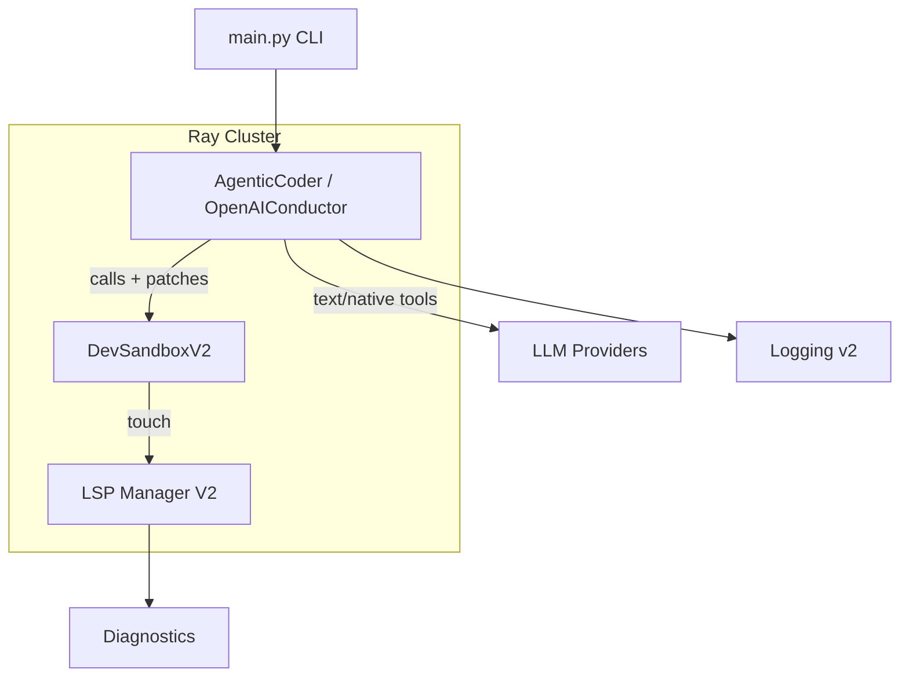
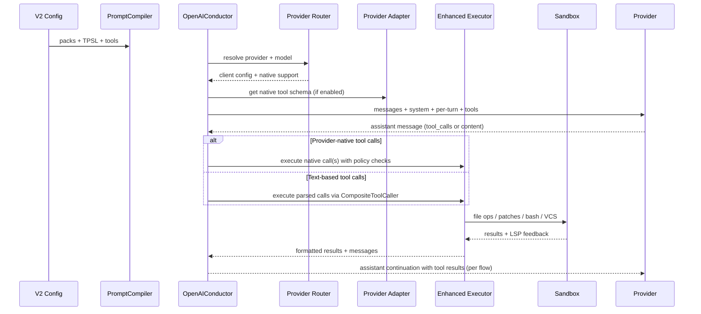
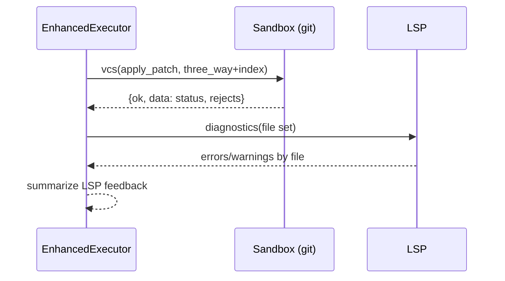
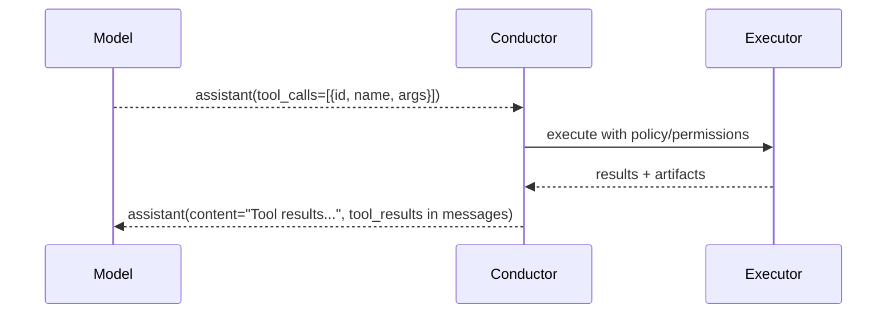

# Ray SCE Agentic Coding System — Full Explanation and Design Report

This document is a comprehensive, system-level report of the repository at `ray_testing/ray_SCE`. It explains the codebase, configuration schema, tests, design decisions, and integration points for agentic coding with LLMs. It merges insights and requirements from your recent specs (ABSTRACTIONS_V3_SPEC.md and AUTO_OPTIM_SPEC.md) and maps them to concrete modules and functions in the implementation.

Table of Contents

- [1. Executive Overview](#1-executive-overview)
  - [1.1 Goals and Requirements (from recent specs)](#11-goals-and-requirements-from-recent-specs)
  - [1.2 High-Level System Diagram](#12-high-level-system-diagram)
- [2. Repository Map](#2-repository-map)
  - [2.1 Top-Level Files](#21-top-level-files)
  - [2.2 Core Agent Implementation](#22-core-agent-implementation)
  - [2.3 Sandbox and LSP Infrastructure](#23-sandbox-and-lsp-infrastructure)
  - [2.4 Implementations: Tools, Prompts, TPSL](#24-implementations-tools-prompts-tpsl)
  - [2.5 Tests and Behavioral Invariants](#25-tests-and-behavioral-invariants)
- [3. Configuration Model (Schema V2) and Compilation](#3-configuration-model-schema-v2-and-compilation)
  - [3.1 Files and Responsibilities](#31-files-and-responsibilities)
  - [3.2 V2 Loader: Extends, Validation, Normalization](#32-v2-loader-extends-validation-normalization)
  - [3.3 Prompt Compiler and TPSL](#33-prompt-compiler-and-tpsl)
  - [3.4 Tool YAML Loader, Overlays, Aliases](#34-tool-yaml-loader-overlays-aliases)
  - [3.5 Provider Routing and Adapters](#35-provider-routing-and-adapters)
- [4. Agentic Loop and Execution](#4-agentic-loop-and-execution)
  - [4.1 OpenAIConductor Actor: Lifecycle](#41-openaiconductor-actor-lifecycle)
  - [4.2 Dialect Selection and Composite Tool Caller](#42-dialect-selection-and-composite-tool-caller)
  - [4.3 Turn Strategy, Tool Prompt Modes](#43-turn-strategy-tool-prompt-modes)
  - [4.4 Execution Flow: Enhanced vs Raw, Native vs Text](#44-execution-flow-enhanced-vs-raw-native-vs-text)
  - [4.5 Concurrency Policy, “One Bash Per Turn”, Completion Isolation](#45-concurrency-policy-one-bash-per-turn-completion-isolation)
  - [4.6 Completion Detector](#46-completion-detector)
  - [4.7 Error Handling](#47-error-handling)
- [5. Logging v2, Telemetry, and Artifacts](#5-logging-v2-telemetry-and-artifacts)
  - [5.1 Run Directory Layout](#51-run-directory-layout)
  - [5.2 Prompt and Provider Artifacts](#52-prompt-and-provider-artifacts)
- [6. Sandbox and Virtualization](#6-sandbox-and-virtualization)
  - [6.1 DevSandboxV2](#61-devsandboxv2)
  - [6.2 Virtualized Sandbox: Path Isolation and Mirroring](#62-virtualized-sandbox-path-isolation-and-mirroring)
  - [6.3 VCS and Patch Application](#63-vcs-and-patch-application)
- [7. Tool Dialects and Formats](#7-tool-dialects-and-formats)
  - [7.1 Supported Dialects and Rationale](#71-supported-dialects-and-rationale)
  - [7.2 Diff and Add-File Policies](#72-diff-and-add-file-policies)
- [8. AUTO_OPTIM Integration (HPO, RL, Prompt Evolution)](#8-auto_optim-integration-hpo-rl-prompt-evolution)
  - [8.1 Unified Reward Signals and Where They Map](#81-unified-reward-signals-and-where-they-map)
  - [8.2 HPO and Prompt Evolution Wiring](#82-hpo-and-prompt-evolution-wiring)
- [9. Tests: Themes, Coverage, and Invariants](#9-tests-themes-coverage-and-invariants)
- [10. Quirks, Edge Cases, and Design Notes](#10-quirks-edge-cases-and-design-notes)
- [11. Quick Recipes and Snippets](#11-quick-recipes-and-snippets)
  - [11.1 Running with Schema V2](#111-running-with-schema-v2)
  - [11.2 Switching Provider-Native Tools](#112-switching-provider-native-tools)
  - [11.3 A Minimal Per-Turn Tools Prompt](#113-a-minimal-per-turn-tools-prompt)
- [12. Appendices](#12-appendices)
  - [A. File-by-Module Function/Class Index](#a-file-by-module-functionclass-index)
  - [B. Mermaid Flows: Agent Loop and Provider-Native Relay](#b-mermaid-flows-agent-loop-and-provider-native-relay)
  - [C. Representative Config (V2) and Commentary](#c-representative-config-v2-and-commentary)
  - [D. Additional Diagrams and Flows](#d-additional-diagrams-and-flows)
  - [E. Extended Test Matrix and Invariants](#e-extended-test-matrix-and-invariants)
  - [F. Design Alternatives and Rationale](#f-design-alternatives-and-rationale)
  - [G. Known Gaps and Future Work](#g-known-gaps-and-future-work)


## 1. Executive Overview

The repository implements a modular, provider-agnostic agentic coding system that can replicate workflows from Cursor, Claude Code, OpenCode, and similar tools via configuration. The architecture separates what the agent is allowed to do (modes, turn strategy, concurrency, permissions) from how the model expresses tool usage (dialects, provider-native tools, or text-based formats). Everything is designed to be swappable, A/B testable, and optimizable per-model.

Key pillars:
- Configuration-driven behaviors with Schema V2 (modes, loop sequence, providers, tools, TPSL prompt catalogs).
- Two-track tool-calling: provider-native schemas when supported; robust text-based dialects otherwise.
- Enhanced execution: validation and policy enforcement (e.g., one bash per turn), LSP diagnostics feedback loop, workspace state tracking.
- Virtualized sandboxing and optional mirroring for development, integrated with VCS/diff application.
- Logging v2 that persistently records prompts, provider requests/responses, tool schemas, and transcripts.
- Hooks for auto-optimization (HPO, prompt evolution) as described in AUTO_OPTIM_SPEC.md.


### 1.1 Goals and Requirements (from recent specs)

From ABSTRACTIONS_V3_SPEC.md:
- Replicate any agentic coder product’s workflow using a modular YAML schema, including planning vs. build/test modes, subagents, and different tool syntaxes.
- Mix provider-native tool calling and text-based dialects; treat diff/edit formats as first-class (Aider, OpenCode, unified diff).
- Clean separation of prompt compilation (cacheable), dialect selection, execution policies, and completion arbitration.

From AUTO_OPTIM_SPEC.md:
- Capture dense per-turn/per-episode metrics: tool-call validity, patch success, LSP improvement, test outcomes, efficiency (latency/tokens), and policy adherence.
- Enable HPO and prompt evolution (and RL later) to converge on per-model optimal settings (prompt content, format preferences, execution constraints).


### 1.2 High-Level System Diagram




## 2. Repository Map

The codebase is purposefully layered. Below is a quick map with intent.

### 2.1 Top-Level Files

- `main.py` — CLI for running tasks (`--task`) or `--interactive`. Loads `.env` best-effort, supports Schema V2 flag. Uses `agentic_coder_prototype.create_agent`.
- `README.md` — Quick usage and architectural overview.
- `ABSTRACTIONS_V3_SPEC.md` — Schema goals, rationale, and SoTA alignment.
- `AUTO_OPTIM_SPEC.md` — Auto-optimization and RL/HPO signals, flow, and wiring plan.
- `RAYCODE_SPEC_V4.md` — System overview and diagrams.
- `requirements.txt`, `pytest.ini` — Environment and test configs.

### 2.2 Core Agent Implementation

- `agentic_coder_prototype/agent.py` — A thin, ergonomic facade (`AgenticCoder`) that loads Schema V2, provisions the workspace, and delegates to a Ray actor (OpenAIConductor).
- `agentic_coder_prototype/agent_llm_openai.py` — The conductor actor, coordinating prompt compilation, provider routing, dialect selection, tool calling (native and text), execution, logging v2, and completion.
- `agentic_coder_prototype/compilation/` — V2 loader, prompt compiler (system + per-turn), TPSL integration, tool YAML loader.
- `agentic_coder_prototype/execution/` — AgentToolExecutor, EnhancedToolExecutor (validation, permissions, LSP integration), DialectManager, CompositeToolCaller.
- `agentic_coder_prototype/dialects/` — Parsing/formatting for multiple tool syntaxes and diff formats.
- `agentic_coder_prototype/state/` — SessionState, CompletionDetector.
- `agentic_coder_prototype/messaging/` — Markdown transcript formatting helpers for tool outputs.
- `agentic_coder_prototype/logging_v2/` — Run logger, API recorder, prompt and provider-native artifacts.
- `agentic_coder_prototype/provider_routing.py` + `provider_adapters.py` — Provider resolution, API keys, and schema translation.

### 2.3 Sandbox and LSP Infrastructure

- `kylecode/sandbox_v2.py` — Workspace-safe, path-normalizing sandbox (file ops, grep, run, VCS via git apply), supports adaptive streaming and LSP touch.
- `kylecode/sandbox_virtualized.py` — Virtualized wrapper with deployment modes (development/testing/production), path virtualization and mirroring for visibility.
- `kylecode/lsp_manager_v2.py` and related — LSP orchestration, diagnostics, and aggregation.

### 2.4 Implementations: Tools, Prompts, TPSL

- `implementations/tools/defs` and `defs_oc` — YAML tool definitions; `enhanced_tools.yaml` is a registry example with constraints and preferences.
- `implementations/system_prompts/` — Prompt pack building blocks referenced by V2 config.
- `implementations/tool_prompt_synthesis/` — TPSL templates used by system prompt compiler for catalogs.

### 2.5 Tests and Behavioral Invariants

`tests/` covers LSP integration, sandbox correctness, Schema V2 loader, prompt compiler, dialect parsing/selection, agent loop, concurrency groups, logging v2, and various dry-run/integration flows. These tests encode many invariants and are valuable as oracles for refactors.


## 3. Configuration Model (Schema V2) and Compilation

### 3.1 Files and Responsibilities

- `agentic_coder_prototype/compilation/v2_loader.py`
- `agentic_coder_prototype/compilation/system_prompt_compiler.py`
- `agentic_coder_prototype/compilation/tool_yaml_loader.py`
- `AGENT_SCHEMA_V2.md` (spec)

Together, these handle:
- Loading YAML config with `extends`, validating required sections, and normalizing for runtime.
- Compiling the system prompt and per-turn tools prompt (optionally via TPSL templates) with content-hash caching.
- Loading tool definitions from YAML with overlays, provider preferences, and manipulations.

### 3.2 V2 Loader: Extends, Validation, Normalization

File: `compilation/v2_loader.py`

Responsibilities:
- `_resolve_extends` merges one or multiple parents before validation; order is left-to-right.
- `_validate_v2` ensures required top-level keys exist: `version==2`, `workspace`, `providers.{default_model,models[]}`, `modes`, and `loop.sequence`.
- `_normalize_for_runtime` hydrates convenience fields for the current runtime (e.g., `tools.defs_dir` derived from the first registry path; copy `turn_strategy`, `concurrency`, `completion`).
- `load_agent_config` gates “V2 mode” on both `version: 2` and `AGENT_SCHEMA_V2_ENABLED=1` for transitional compatibility.

Example: derived defs_dir

```python
paths = registry.get("paths") or []
if paths and not tools.get("defs_dir"):
    tools["defs_dir"] = str(paths[0])
```

Design decisions:
- Keep legacy compatibility by falling back to JSON/YAML raw loads if V2 validation fails.
- Enable conditional mode selection via `loop.sequence` (`if`/`then`/`mode`) and copy turn strategy into a flat key for the executor.

### 3.3 Prompt Compiler and TPSL

File: `compilation/system_prompt_compiler.py`

Highlights:
- Maintains catalog of dialects and research-based format preferences (Aider > OpenCode > Unified).
- Computes a stable, short cache key from tools, dialects, and prompt input (`sha256` → first 12 hex chars) to write/read cached system prompts under `implementations/tooling_sys_prompts_cached/`.
- Supports minimal system prompt for `per_turn_append` mode (append a per-turn tools prompt into the user message instead of enumerating tools in system every turn).
- V2 mode: `compile_v2_prompts` resolves packs (`@pack(base).system`), mode-specific prompt, and TPSL catalogs, producing:
  - `system`: compiled system prompt
  - `per_turn`: compiled per-turn tools prompt (short catalog)
  - optional `tpsl` metadata with template ids, dialect, and detail

Design decisions:
- Avoid duplication in the assembled prompt using a text-hash set.
- Persist compiled artifacts through Logging v2 for traceability.

### 3.4 Tool YAML Loader, Overlays, Aliases

File: `compilation/tool_yaml_loader.py`

Capabilities:
- Loads each YAML file into an `EnhancedToolDefinition` (blocking, supported_formats, provider_routing, preferred_formats, dependencies, etc.).
- Overlays support: rename tools, override descriptions, set syntax styles, and set provider preferences (e.g., make a tool native-primary on OpenAI).
- Returns both tool definitions and a `manipulations_by_id` map so the executor can inform routing/validation.

Example YAML (abridged):

```yaml
id: run_shell
name: run_shell
description: Execute a shell command
type_id: python
execution:
  blocking: true
  max_per_turn: 1
provider_routing:
  openai:
    native_primary: true
```

### 3.5 Provider Routing and Adapters

Files: `provider_routing.py`, `provider_adapters.py`

- Router parses model IDs like `openrouter/openai/gpt-5-nano` into `(provider, actual_model, routing_path)` and returns a `ProviderConfig` with API key env var and base URL (OpenRouter uses OpenAI format with an alternate base URL and headers).
- `should_use_native_tools(model, config)` respects both provider capability and user override (`provider_tools.use_native`), and filters to models that support native tools (OpenRouter: native only for OpenAI-family targets).
- Adapters translate our internal tool definitions to provider-native schemas (OpenAI JSON schema; Anthropic tool_use format), extract tool calls from responses, and create provider-expected tool result messages.


## 4. Agentic Loop and Execution

### 4.1 OpenAIConductor Actor: Lifecycle

File: `agent_llm_openai.py` (`@ray.remote class OpenAIConductor`)

Initialization:
- Workspace selection honors `config.workspace.root`; mirrors may be enabled via `workspace.mirror` with `SandboxFactory` creating a virtualized sandbox (development/testing/production modes). Otherwise falls back to `DevSandboxV2` local-host.
- DialectManager, YAML tool loading, enhanced config validator, and EnhancedToolExecutor are initialized early.
- Logging v2 is started with a sanitized session id (workspace basename) and artifacts helpers are created (APIRequestRecorder, PromptArtifactLogger, MarkdownTranscriptWriter, ProviderNativeLogger).
- Session-scoped helpers: MessageFormatter, AgentToolExecutor.

Primary entrypoint:
- `run_agentic_loop(system_prompt, user_prompt, model, max_steps, output_json_path, stream_responses, output_md_path, tool_prompt_mode, completion_sentinel, completion_config)`
  - Determines provider and client (via `provider_router`), validates API key presence.
  - Loads tool definitions (YAML-first, fallback to defaults), compiles system/per-turn prompts (V2), prepares native or text-based tools based on model and config.
  - Iterates up to `max_steps`, obtaining a model response each turn, parsing tool calls (native or text), executing them with policy enforcement, relaying results as configured, and checking completion.
  - Writes a final snapshot with a VCS diff.

### 4.2 Dialect Selection and Composite Tool Caller

- `execution/dialect_manager.py` filters requested dialects by model profile (exclusive/mixed/fallback), exclusions, and preferred operation types. V2 integrates selection-by-model/tool-kind.
- `execution/composite.py (CompositeToolCaller)` aggregates `BaseToolDialect` instances, formats per-dialect tool prompts, and parses tool calls across dialects. De-duplicates parsed calls by a stable `(function|json(args))` key.

### 4.3 Turn Strategy, Tool Prompt Modes

Key options surfaced via config and function parameters:
- `tool_prompt_mode`: `system_once` | `per_turn_append` | `system_and_per_turn` | `system_compiled_and_persistent_per_turn` | `none`.
- Schema V2 configs surface this via `prompts.tool_prompt_mode`; legacy configs continue to use `prompt.mode`.
- `turn_strategy.relay`: `tool_role` vs `user_message` result routing; `flow`: `assistant_continuation` (preferred; tool results summarized in assistant’s voice) or alternatives.
- TPSL: per-turn short catalog appended either persistently or temporarily, persisted to run logs for reproducibility.

### 4.4 Execution Flow: Enhanced vs Raw, Native vs Text

Two tool paths in the loop:
- Provider-native tool calls (OpenAI/Anthropic):
  - Extract provider tool calls with IDs via adapter.
  - Execute each call with the `AgentToolExecutor` policy layer and `EnhancedToolExecutor` (permissions, path normalization, create-file policy, optional LSP feedback), then relay results back to the model according to `turn_strategy.flow` (assistant continuation by default).
  - Persist provider-native tools provided, tool calls, and tool results via Logging v2.

- Text-based tool calls (dialects like Pythonic XML, Bash blocks, Aider/Unified/OpenCode diffs):
  - Parse calls via CompositeToolCaller.
  - Enforce policies via AgentToolExecutor and route to EnhancedToolExecutor for execution.
  - Use MessageFormatter to format TOOL_OUTPUT/PATCH_RESULT/BASH_RESULT blocks, add a synthetic `tool_result` message into `messages` for provider clarity.

Enhanced execution highlights (file: `execution/enhanced_executor.py`):
- Path normalization ensures workspace-relative arguments; shields the model from leaking absolute paths.
- Create-file policy: prefer direct `write_text` for Aider “create” cases; normalize unified diff add-file headers to `/dev/null` when configured.
- Permissions checks: allow/deny policies for shell and writes.
- Optional sequence validator rules (except LSP rule, which is delegated to LSP-enhanced sandbox).
- LSP feedback summarization per operation, attached in tool results under `lsp_feedback` and aggregated in MessageFormatter outputs.

### 4.5 Concurrency Policy, “One Bash Per Turn”, Completion Isolation

File: `execution/agent_executor.py`

- `determine_execution_strategy` groups calls into nonblocking vs blocking; runs nonblocking concurrently if safe; otherwise sequentially while respecting “only one bash per turn”.
- `check_completion_isolation` enforces that `mark_task_complete()` must be isolated in a turn.
- `reorder_operations` prioritizes file creation/patch before bash for better reliability.
- `is_tool_failure` classifies failures to trigger cancellation of remaining calls in the turn, with a clear transcript note.

These implement the policy findings cited in ABSTRACTIONS_V3 and the industry refs: bash is blocking and brittle; diff edits first; completion after all ops.

### 4.6 Completion Detector

File: `state/completion_detector.py`

- Multi-signal completion: explicit tool (`mark_task_complete`), text sentinels, provider finish reasons, and natural language heuristics.
- Confidence thresholding is adaptive when the completion tool is not available in the config (boosts acceptance of natural finishes).

### 4.7 Error Handling

File: `error_handling/error_handler.py`

- Provider error snapshots include messages/transcript and a hint for missing API keys.
- Execution and validation errors are formatted for assistant display with clear tags.
- Empty provider responses break the loop to avoid thrashing.


## 5. Logging v2, Telemetry, and Artifacts

### 5.1 Run Directory Layout

File: `logging_v2/run_logger.py` (class `LoggerV2Manager`)

- Creates a timestamped run directory under `logging/` with standardized subtrees:
  - `conversation/` for the running transcript, including pointer sections to tool catalogs.
  - `raw/requests` and `raw/responses` for provider payloads (with redaction for API keys).
  - `prompts/` storing compiled system and per-turn catalogs; `catalogs/` manifests.
  - `provider_native/` for provided tool schemas, tool calls, and tool results.
  - `artifacts/` for tool result text files and diffs.
  - `meta/` for run metadata.

### 5.2 Prompt and Provider Artifacts

- `prompt_logger.py` persists compiled system and per-turn prompt blocks; `provider_native_logger.py` stores provider-native tools/calls/results as JSON.
- `markdown_transcript.py` writes sectioned Markdown updates that the conductor appends to `conversation.md`.


## 6. Sandbox and Virtualization

### 6.1 DevSandboxV2

File: `kylecode/sandbox_v2.py`

Key functions:
- Path-normalized file operations: `write_text`, `read_text`, `edit_replace`, `multiedit`, `ls`, `stat`, `exists`, `glob`, `list_files`, `grep`.
- Command execution: `run(cmd, timeout, stdin_data, env, stream, shell)` returns adaptive-encoded output, designed for efficient streaming.
- VCS operations: `vcs({action, params})` with CRUD around `git apply`, `status`, `diff`, `add`, `commit`; robust reject capture; touches LSP on changes.

Design notes:
- `_resolve_path` guarantees workspace confinement and safely handles absolute paths that already include the workspace prefix.
- Grep prefers ripgrep if available for performance, with Python fallback.

### 6.2 Virtualized Sandbox: Path Isolation and Mirroring

File: `kylecode/sandbox_virtualized.py`

- `DeploymentMode`: development/testing/production with varying isolation and mirroring behavior.
- `SandboxFactory.create_sandbox` constructs a base `DevSandboxV2` with runtime env, wraps it with `VirtualizedSandbox` that:
  - Virtualizes paths so the model sees clean relative paths.
  - Mirrors files to a visible workspace when in development mode for easy manual inspection.
  - Provides export and cleanup helpers.

### 6.3 VCS and Patch Application

- Unified diff application via `git apply` with `--3way`, `--index`, and `--whitespace` controls; collects `.rej` files on failure, reports granular status (added/modified/deleted/untracked), and touches LSP for changed files.


## 7. Tool Dialects and Formats

### 7.1 Supported Dialects and Rationale

Files: `agentic_coder_prototype/dialects/*`

Included:
- Pythonic (XML-ish) for explicit `<TOOL_CALL>` semantics.
- Bash block for shell commands.
- Diff formats: Aider SEARCH/REPLACE, OpenCode “Add File” patch, and Git-style unified diff.
- Provider-native (OpenAI/Anthropic) via adapters.

Rationale:
- Some models excel with structured text-based calls; others prefer provider-native schema. Diff reliability depends heavily on the format—Aider often yields higher success rates for smaller models; unified diff remains closest to Git semantics; OpenCode format provides strong structure for add-file.

### 7.2 Diff and Add-File Policies

- `system_prompt_compiler` encodes format preferences in docs and per-turn availability lists.
- Enhanced executor policies:
  - Aider: prefer direct `write_text` for “create” cases rather than forcing a faux diff.
  - Unified diff: normalize add-file headers to `/dev/null` when configured.
  - Enforce “one bash per turn”, block bash from coexisting with other blocking ops, and reorder to execute file ops before bash.


## 8. AUTO_OPTIM Integration (HPO, RL, Prompt Evolution)

The codebase contains the touchpoints to emit signals and persist artifacts that AUTO_OPTIM specifies.

### 8.1 Unified Reward Signals and Where They Map

From AUTO_OPTIM_SPEC.md, representative signals and how the current system can support them:
- Tool-call validity (SVS/ACS/CPS): validators in `AgentToolExecutor` and `EnhancedToolExecutor` can emit compliance booleans; Logging v2 captures payloads for post-hoc analysis.
- Patch success (PAS) and Hunk Match Ratio (HMR): available from VCS responses and `.rej` aggregation; can be summarized per turn.
- LSP error delta (LED) and syntax/build status (SBS): `EnhancedToolExecutor` attaches `lsp_diagnostics` and a short `lsp_feedback` summary per edit/create.
- Test pass fraction (TPF): available when tasks include tests executed via `run_shell` (pytest), recorded into transcript and logs.
- Efficiency (TE/LE, TOE): tokens and latency are present in provider payloads; counts of tool calls per turn are recorded; turn timer hooks can be added.
- Policy adherence (SPA): bash-per-turn, reordering, completion isolation enforced and can be logged.

Storage: `tool_calling_performance.db` demonstrates the SQLite schema used by `monitoring/performance_monitor.py`; it can be extended to capture the full reward vector.

### 8.2 HPO and Prompt Evolution Wiring

- Prompt compilation already computes content hashes and stores compiled artifacts; a prompt-evolver can mutate inputs (packs/templates) and track outcome deltas per model.
- Dialect selection can be configured per model and per mode; combined with performance snapshots, the HPO harness can search over preferred format orderings and retry rules.
- Provider-native vs text-based toggles are one-line config changes—ideal for A/B and bandits.


## 9. Tests: Themes, Coverage, and Invariants

Highlights from `tests/`:
- Schema V2 loader (`test_schema_v2_loader.py`) — extends/validation; workspace and providers requirements.
- Prompt compiler V2 (`test_prompt_compiler_v2.py`) — packs resolution, TPSL catalogs, deduplication and cache keys.
- Dialect selection and parsing (`test_dialect_selection_v2.py`, `test_dialect_parsing` in enhanced tests).
- Enhanced executor validation and routing (`test_enhanced_executor_validation.py`, `test_enhanced_executor_routing.py`).
- Concurrency groups and “one bash per turn” invariants (`test_concurrency_groups.py`).
- LSP integration and diagnostics in sandbox flows (`test_sandbox_lsp_integration.py`, `test_lsp_manager_v2.py`).
- Logging v2 smoke tests (`test_logging_v2_basic.py`).

These codify key behaviors: safe workspace confinement, deterministic prompt assembly, stable dialect selection per model, sequenced edits-before-bash, and isolated completion calls.


## 10. Quirks, Edge Cases, and Design Notes

- Path normalization is tackled in two layers: the sandbox itself (`_resolve_path`) and the enhanced executor (argument normalization). This defends against absolute path leakage and double-prefixing of workspace roots.
- Provider-native tool schemas differ: OpenAI uses JSON schema; Anthropic uses `tool_use`. Adapters isolate these differences; native availability through OpenRouter is limited to OpenAI family models.
- V2 config gating: If `AGENT_SCHEMA_V2_ENABLED` is set, the loader is stricter; otherwise, YAML/JSON legacy configs are accepted for resilience.
- Bash commands: enforced to a single call per turn—this is a deliberate, research-backed constraint to improve success.
- Add-file semantics: unified diff `--- /dev/null` vs. OpenCode “Add File” block vs. Aider (which doesn’t natively create files). Policies cover these cases to avoid brittle model behaviors.
- Logging v2 redacts known secret keys from stored payloads.

Additional nuanced behaviors:
- Tool prompt suppression for native tools: when `provider_tools.suppress_prompts` is true and the model supports native tools, the compiled per-turn prompt is omitted and only provider-native schemas are sent. This helps avoid mixed instructions that degrade provider-native performance.
- Adaptive minimum: if the model responds with neither tool calls nor content, the loop records an empty-response sentinel and breaks (to avoid unproductive turns).
- Native tools relay strategy: “assistant continuation” prevents spawning alternate roles that can confuse some providers and keeps a consistent assistant persona while still incorporating tool results.


## 11. Quick Recipes and Snippets

### 11.1 Running with Schema V2

```bash
export AGENT_SCHEMA_V2_ENABLED=1
python main.py agent_configs/opencode_gpt5_nano_c_fs_v2.yaml -t "Implement a small C mini-FS with tests"
```

### 11.2 Switching Provider-Native Tools

In your V2 YAML:

```yaml
provider_tools:
  use_native: true     # let models that support native tools use them
  suppress_prompts: false
```

### 11.3 A Minimal Per-Turn Tools Prompt

When using `tool_prompt_mode: per_turn_append`, the compiler emits a minimal system prompt and appends a short tools availability block each turn:

```text
<TOOLS_AVAILABLE>
**Available Tools for this turn:**
- read_file
- list_dir
- apply_unified_patch
...
</TOOLS_AVAILABLE>
```


## 12. Appendices

### A. File-by-Module Function/Class Index

This index lists the primary public classes and functions and what they do. For brevity, internal helpers and simple accessors are summarized.

- `main.py`
  - `main()` — CLI parser; loads `.env`; `AGENT_SCHEMA_V2_ENABLED` feature flag; creates `AgenticCoder`; drives interactive or single-task runs.

- `agentic_coder_prototype/agent.py`
  - `class AgenticCoder` — Facade for config loading, workspace setup, and delegating to the actor.
    - `initialize()` — `ray.init()`, create `OpenAIConductor` actor.
    - `run_task(task, max_iterations)` — Read file-or-text prompt; call `run_agentic_loop` on the actor; return result.
    - `interactive_session()` — REPL that calls the actor for each user turn.
    - `get_workspace_files()` — Walk workspace to list files.
    - `_load_config()` — V2 loader first, legacy fallback.
    - `_select_model()` — V2 providers.default_model, legacy fallback to `model`.
  - `create_agent(config_path, workspace_dir)` — Convenience factory.

- `agentic_coder_prototype/agent_llm_openai.py`
  - `class OpenAIConductor(ray.actor)` — Core actor orchestrating the loop.
    - `__init__(workspace, image, config)` — Sandbox selection (virtualized or dev), DialectManager, YAML tools, EnhancedToolExecutor, Logging v2 setup, message/agent executors.
    - `run_agentic_loop(system_prompt, user_prompt, model, ...)` — Main loop: provider client creation, prompt compilation (V2), choose native vs text tools, tool prompt assembly, per-turn provider calls, parse/execute tools, relay results, detect completion, snapshot.
    - `vcs(request)` — Proxy to sandbox VCS.
    - `_get_model_response(...)` — Build provider messages, apply per-turn tool prompt rules, persist provider-native tool schemas, record raw requests/responses.
    - `_process_model_output(...)` — Parse tool calls (native/text), execute with AgentToolExecutor and EnhancedToolExecutor, handle failures and transcript logging, feed continuation.
    - `_tool_defs_from_yaml` / `_get_default_tool_definitions` — Toolset source.
    - `_create_dialect_mapping`, `_apply_v2_dialect_selection` — Dialect set assembly.
    - `create_tool_result_entry(...)` (via EnhancedToolExecutor) — Normalized tool result message.
    - `compute_tool_prompt_mode(...)` — Helper for testing behavior of prompt mode selection.

- `agentic_coder_prototype/compilation/v2_loader.py`
  - `load_agent_config(path)` — Resolve `extends`, validate Schema V2, normalize, or return raw legacy config.
  - Helpers: `_load_yaml`, `_deep_merge`, `_resolve_extends`, `_validate_v2`, `_normalize_for_runtime`, `is_v2_config`.

- `agentic_coder_prototype/compilation/system_prompt_compiler.py`
  - `class SystemPromptCompiler`
    - `get_or_create_system_prompt(tools, dialects, primary_prompt, tool_prompt_mode)` — Cached prompt generation.
    - `compile_v2_prompts(config, mode_name, tools, dialects)` — Pack- and TPSL-aware system + per-turn outputs.
    - `format_per_turn_availability(enabled_tools, enabled_dialects)` — Short availability block.
    - Internal: cache key computation, minimal prompt for per-turn mode, metadata headers, format preference ordering.
  - `get_compiler()` — Global instance getter.

- `agentic_coder_prototype/compilation/tool_yaml_loader.py`
  - `load_yaml_tools(defs_dir, overlays, aliases)` — Load EnhancedToolDefinition list and manipulations map; apply overlays (rename/description/syntax/provider preference).

- `agentic_coder_prototype/execution/agent_executor.py`
  - `class AgentToolExecutor`
    - `validate_tool_calls(tool_calls)` — Optional design decision constraints.
    - `check_completion_isolation(parsed_calls)` — Enforce isolated `mark_task_complete`.
    - `reorder_operations(parsed_calls)` — Put file ops before bash.
    - `determine_execution_strategy(parsed_calls)` — Decide sequential vs. nonblocking concurrent.
    - `execute_parsed_calls(...)` — Execute with concurrent/sequential helpers and failure cancellation.

- `agentic_coder_prototype/execution/enhanced_executor.py`
  - `class EnhancedToolExecutor`
    - `execute_tool_call(tool_call, original_executor)` — Permissions, path normalization, create-file policy, run tool, track workspace state, post-process LSP feedback, wrap result with execution metadata.
    - `get_workspace_context` / `export_session_data` — Context for prompts and analysis.
    - Internal: `_normalize_argument_paths`, `_normalize_udiff_add_headers`, `_apply_create_file_policy_for_search_replace`, `_post_execution_processing` (LSP), `_check_permissions`.

- `agentic_coder_prototype/execution/dialect_manager.py`
  - `class DialectManager`
    - `get_dialects_for_model(model_id, requested)` — Profile-based filtering by `mode` (`exclusive|mixed|fallback`) and exclusions.
    - `get_operation_dialect(model_id, operation_type)` — Preferred dialect for operation kinds (if configured).

- `agentic_coder_prototype/execution/composite.py`
  - `class CompositeToolCaller`
    - `build_prompt(tools)` — Per-dialect sections.
    - `parse_all(text, tools)` — Aggregate and de-duplicate parsed calls across dialects.

- `agentic_coder_prototype/state/session_state.py`
  - `class SessionState` — In-memory messages, provider_messages, transcript; writes snapshots (`write_snapshot`).

- `agentic_coder_prototype/state/completion_detector.py`
  - `class CompletionDetector` — Multi-signal completion with adaptive thresholds when completion tool is disabled.

- `agentic_coder_prototype/messaging/message_formatter.py`
  - `class MessageFormatter` — Formats tool outputs: `TOOL_OUTPUT`, `PATCH_RESULT`, and `BASH_RESULT`. Includes tree view for list_dir and LSP summaries for edits.

- `agentic_coder_prototype/logging_v2/*`
  - `LoggerV2Manager` — Run dir, redaction, JSON/text writing; retention policy.
  - `APIRequestRecorder`, `PromptArtifactLogger`, `ProviderNativeLogger`, `MarkdownTranscriptWriter` — Specialized artifact writers.

- `agentic_coder_prototype/provider_routing.py`
  - `class ProviderRouter`
    - `parse_model_id(model_id)` — Split into provider/routing path; supports `openrouter/openai/...` three-part IDs.
    - `get_provider_config(model_id)` — Resolve `ProviderConfig`, actual model ID, and whether native tools are supported for this target.
    - `should_use_native_tools(model_id, user_config)` — Provider capability gated by user override.
    - `create_client_config(model_id)` — Prepare provider client kwargs (base_url, default headers, API key).
  - `provider_router` — Global instance.

- `agentic_coder_prototype/provider_adapters.py`
  - `class OpenAIAdapter`
    - `should_use_native_tool(tool_def)` — Reads YAML `provider_routing.openai.native_primary`.
    - `translate_tool_to_native_schema(tool_def)` — JSON schema for function calling, including required/defaults.
    - `extract_tool_calls_from_response(response_message)` — Normalize OpenAI tool calls (id, name, arguments).
    - `create_tool_result_message(call_id, tool_name, result)` — Formats tool result for OpenAI tool result messages.
  - `class AnthropicAdapter` — Placeholders for tool_use schema.
  - `provider_adapter_manager` — Global multiplexer that picks the adapter per provider id.

- `kylecode/sandbox_v2.py`
  - `class DevSandboxV2(ray.actor)` — Workspace-confined FS ops, grep, run, and VCS. Adaptive iterable support and LSP touches on write/edit.

- `kylecode/sandbox_virtualized.py`
  - `class VirtualizedSandbox(ray.actor)`, `SandboxFactory` — Path virtualization, development mirroring, session lifecycle helpers.


### B. Mermaid Flows: Agent Loop and Provider-Native Relay

Agent loop with native-vs-text decision and assistant continuation flow:




### C. Representative Config (V2) and Commentary

File: `agent_configs/opencode_gpt5_nano_c_fs_v2.yaml` (abridged):

```yaml
extends: base_v2.yaml
providers:
  default_model: openrouter/openai/gpt-5-nano
  models:
    - id: openrouter/openai/gpt-5-nano
      adapter: openai
prompts:
  packs:
    base:
      system: implementations/system_prompts/default.md
  tool_prompt_synthesis:
    enabled: true
    dialects:
      pythonic:
        system_full: implementations/tool_prompt_synthesis/pythonic/system_full.j2.md
      unified_diff:
        system_full: implementations/tool_prompt_synthesis/unified_diff/system_full.j2.md
    selection:
      by_model:
        "openrouter/openai/*": pythonic
      by_mode:
        build: unified_diff
tools:
  registry: { paths: [implementations/tools/defs_oc], include: ["*"] }
  dialects: { order: [opencode_patch, bash_block, unified_diff] }
modes:
  - name: build
    tools_enabled: ["*"]
loop:
  sequence:
    - mode: build
  turn_strategy: { relay: tool_role, flow: assistant_continuation }
workspace:
  root: ./agent_ws_opencode
  mirror: { enabled: true, path: ./agent_ws_opencode, mode: development }
```

Commentary:
- Providers: route through OpenRouter while keeping OpenAI’s tool schema for native calls when relevant.
- Prompts: TPSL-enabled with per-mode dialect selection (pythonic for model family, unified diff for build mode).
- Tools: switch to OpenCode-style defs to match the C-filesystem testbed; order favors OpenCode diff blocks for add-file.
- Loop and turn strategy: assistant continuation pattern and tool role relay are used to keep the conversation coherent.
- Workspace mirroring: makes development sessions visible on disk while preserving isolated execution.


### D. Additional Diagrams and Flows

Tool execution strategy and concurrency selection:

```mermaid
flowchart LR
  A[Parsed tool calls] --> B{Any blocking calls?}
  B -- Yes --> S[Sequential execution]
  B -- No --> C{>1 nonblocking?}
  C -- Yes --> P[Parallel (thread pool)]
  C -- No --> S
  S --> O[One bash per turn enforced]
  P --> O
```

VCS patch application and LSP feedback loop:



Provider-native tool relay (OpenAI):




### E. Extended Test Matrix and Invariants

Notable tests and the guarantees they provide:

- `test_dialect_selection_v2.py` — Ensures that model- and mode-based dialect selection produces the intended list for the CompositeToolCaller, catching regressions when adding/removing dialects or changing defaults.
- `test_concurrency_groups.py` — Validates that configured nonblocking tools may run concurrently and that blocking groups serialize; covers barrier-like behavior where applicable.
- `test_create_file_policy.py` — Confirms that create-file flows use direct writes when configured for Aider, and that unified diff add-file headers normalize to `/dev/null`.
- `test_provider_native_routing.py` — Checks that OpenRouter routing only uses native tools for OpenAI family targets; all others fall back gracefully to text-based dialects.
- `test_logging_v2_basic.py` — Smoke test to ensure runs create directories, redact sensitive keys, and write expected artifacts.
- `test_completion_detector_v2.py` — Verifies confidence thresholds and boosted acceptance when the completion tool is disabled.

These tests, combined, enforce core behaviors: safe and deterministic prompt assembly, policy enforcement on tool sequencing, robust diff application, and clean provider-native round-trips.


### F. Design Alternatives and Rationale

- Provider-native only vs. mixed mode: The code supports both, but maintains text-based dialects because diff/edit workflows are more reliable with explicit formats and because not all providers expose equally strong native schemas.
- One bash per turn: Empirically reduces brittle multi-command failures and simplifies partial-failure handling; parallelism is reserved for safe reads.
- Prompt placement: `per_turn_append` vs `system_once` vs “system+per-turn” hybrid — chosen based on model behavior; the compiler and logger persist both for auditability and A/B tests.
- Virtualization approach: A minimal path-virtualizing wrapper instead of deep chroot/overlay filesystems, trading maximum isolation for developer ergonomics in development mode.


### G. Known Gaps and Future Work

- Anthropic adapter: full extraction/relay of tool_use events to parity with OpenAI adapter.
- More granular reward logging: emit the full reward vector described in AUTO_OPTIM_SPEC directly from the loop (currently all components exist; wiring is incremental).
- Subagents: skeleton support is present in the schema, but a concrete supervisor and budget isolation per subagent would complete the feature.
- More dialects: e.g., JSON/YAML block commands for general tools beyond diffs could be expanded with strict schemas.
- End-to-end examples: add turnkey configs for reproducing Cursor/Claude/OpenCode behaviors with included demo projects.


---

This report should give you a deep mental model of how the repository is organized, how Schema V2 governs behavior, where provider-native tools fit, how the execution and logging layers interact, and where to wire in optimization signals per AUTO_OPTIM_SPEC. It is deliberately modular so you can replicate nearly any agentic coding product’s workflow by editing YAML and (optionally) swapping adapters/dialects.
