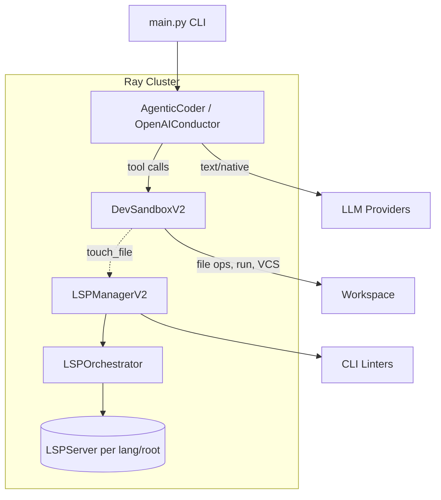
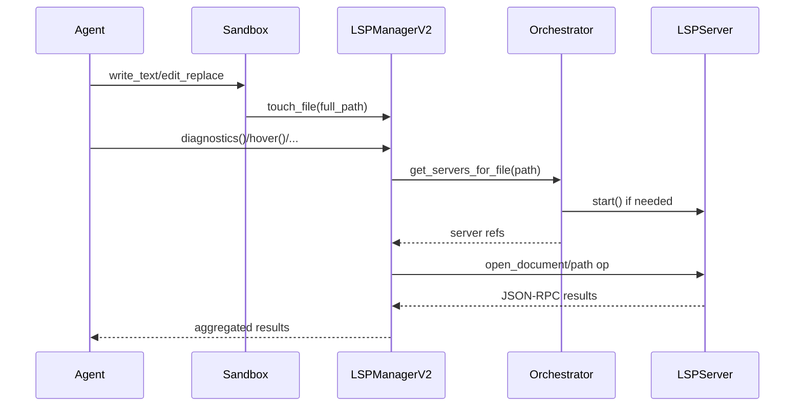
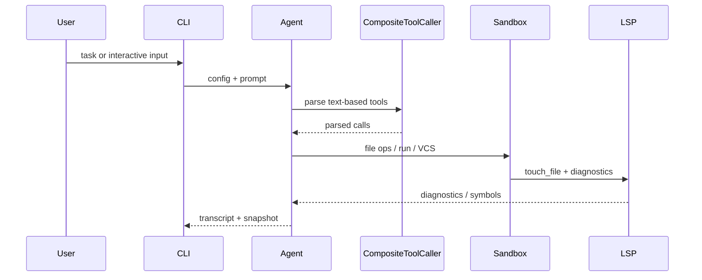

### RAYCODE Spec v4

This document is a high-signal technical specification for the KyleCode agentic coding system. It covers motivations, architecture, modules, interfaces, deployment, and operational notes. Links below jump to sections.

### Table of Contents
- [Introduction and Motivations](#introduction-and-motivations)
- [Top-level Architecture](#top-level-architecture)
- [Language Server Platform (LSP) System](#language-server-platform-lsp-system)
  - [LSP JSON-RPC Client](#lsp-json-rpc-client)
  - [LSPServer Actor](#lspserver-actor)
  - [LSPOrchestrator](#lsporchestrator)
  - [UnifiedDiagnostics](#unifieddiagnostics)
  - [LSPManagerV2](#lspmanagerv2)
  - [Deployment and Scaling](#deployment-and-scaling)
- [Sandboxing with Ray + gVisor](#sandboxing-with-ray--gvisor)
  - [DevSandboxV2 API](#devsandboxv2-api)
  - [LSP-Enhanced Sandbox](#lsp-enhanced-sandbox)
  - [Container Templates and Dockerfiles](#container-templates-and-dockerfiles)
- [Agentic Coder Prototype (Modularization)](#agentic-coder-prototype-modularization)
  - [Core Loop and Execution](#core-loop-and-execution)
  - [Tool Definitions and Dialects](#tool-definitions-and-dialects)
  - [Provider Routing and Native Tools](#provider-routing-and-native-tools)
  - [Session State, Logging, and Errors](#session-state-logging-and-errors)
- [Configuration](#configuration)
- [Testing and Behavioral Invariants](#testing-and-behavioral-invariants)
- [Mermaid Diagrams](#mermaid-diagrams)
  - [System Architecture](#system-architecture)
  - [LSP Flow](#lsp-flow)
  - [Agent Tool Execution Flow](#agent-tool-execution-flow)
- [Operational Guidance](#operational-guidance)

### Introduction and Motivations
KyleCode is a modular agentic coding system that can generate, modify, lint, and debug code autonomously. It emphasizes:
- Multi-language code intelligence via LSPs.
- Secure, isolated execution via gVisor containers orchestrated by Ray actors.
- A clean separation of concerns in a prototype agent that supports multiple tool syntaxes, providers, and execution strategies.

Primary goals:
- Reliability and safety: sandboxed execution using `runsc` (gVisor) where available, optional local fallback.
- Extensibility: pluggable tools, providers, and dialects; LSPs as first-class assistants for feedback.
- Scale: Ray-based distributed orchestration of sandboxes and LSP instances.

### Top-level Architecture
Key directories and entry points:
- `main.py` CLI for running tasks or interactive sessions.
- `agentic_coder_prototype/` agent system (LLM interactions, tools, execution).
- `kylecode/` infrastructure (LSP, sandboxing, deployment).
- `agent_configs/` YAML configs for agent behavior and tool availability.
- `implementations/` tool definitions, prompts, sample tasks.
- `tests/` coverage for LSP, sandbox, agent workflows.

High-level components:
1) Agent layer issues tool calls, applies diffs, and logs transcripts.
2) LSP layer aggregates diagnostics and code intelligence.
3) Sandbox layer executes commands and file ops with isolation; integrates LSP feedback.
4) Ray coordinates distributed actors for scaling and isolation.

### Language Server Platform (LSP) System
Files: `kylecode/lsp_manager_v2.py`, `kylecode/lsp_deployment.py`.

#### LSP JSON-RPC Client
`LSPJSONRPCClient` wraps stdin/stdout JSON-RPC for stdio-speaking LSP servers. Responsibilities:
- Incremental request IDs, notifications vs. requests.
- Minimal response parsing and capturing diagnostics buffer.

Key methods: `_send_request(method, params)`, `_send_notification(method, params)`, `_read_response()`, `shutdown()`.

#### LSPServer Actor
`@ray.remote class LSPServer(server_id, workspace_root, container_image)`
- Spawns a language server either as a direct process or inside a container when `LSP_USE_CONTAINERS=1`.
- Validates `requires` via `shutil.which` before launch.
- Initializes with `initialize` request and advertises capabilities.
- Exposes LSP operations: `open_document`, `get_diagnostics`, `hover`, `go_to_definition`, `find_references`, `workspace_symbols`, `document_symbols`, `format_document`, `code_actions`, `completion`.

Config: `LSP_SERVER_CONFIGS` maps language IDs to file extensions, root detection patterns, command lines, and initialization options (e.g., Python uses `pyright-langserver --stdio`).

#### LSPOrchestrator
`@ray.remote class LSPOrchestrator`
- Determines which servers should serve a file by extension and by finding a project root (searching root patterns upward).
- Maintains a cache of active servers keyed by `(server_id, root)` and a `broken_servers` set to avoid retry loops.

#### UnifiedDiagnostics
`@ray.remote class UnifiedDiagnostics`
- Aggregates diagnostics from active LSP servers and CLI linters (ruff, eslint, clippy), de-duplicates, sorts by severity and location.
- Entry point: `collect_all_diagnostics(file_path)` returns `{path -> [diagnostic]}`.

#### LSPManagerV2
`@ray.remote class LSPManagerV2`
- User-facing facade. Tracks registered workspace roots and touched files.
- Public async methods: `diagnostics()`, `hover()`, `workspace_symbol()`, `document_symbol()`, `go_to_definition()`, `find_references()`, `format_document()`, `code_actions()`, `completion()`, `shutdown()`.
- Internally composes `LSPOrchestrator` and `UnifiedDiagnostics`.

#### Deployment and Scaling
`kylecode/lsp_deployment.py`
- `LSPClusterManager`: creates pools of `LSPManagerV2` per language, with resource hints; provides round-robin `get_lsp_server` and health checks.
- `LSPProxyRouter`: routes per-request to an appropriate server based on file extension.
- `LSPDeploymentConfig`: dev and prod presets; toggles container use via env var `LSP_USE_CONTAINERS`.
- `deploy_lsp_system(config, workspace_roots)` sets env and returns a `LSPClusterManager` with deployed servers.

### Sandboxing with Ray + gVisor
Files: `kylecode/sandbox_v2.py`, `kylecode/sandbox_lsp_integration.py`, `kylecode/sandbox.py`.

Runtime selection:
- `sandbox_v2.sandbox_env()` reads `RAY_DOCKER_RUNTIME` (default `runsc`) to prefer gVisor when Ray launches Docker-backed actors.
- `new_dev_sandbox_v2(...)` uses Docker runtime when `RAY_USE_DOCKER_SANDBOX=1`; otherwise falls back to host workspace.

#### DevSandboxV2 API
`@ray.remote class DevSandboxV2(image, session_id?, workspace, lsp_actor?)`
- Path-safe file APIs: `put`, `get`, `read_text`, `write_text`, `edit_replace`, `multiedit`, `exists`, `stat`, `glob`, `list_files`, `grep`.
- Command execution: `run(cmd, timeout?, stdin_data?, env?, stream?, shell?)` returns adaptive-encoded iterable, materialized for Ray.
- VCS: `vcs({action, params, user})` implements `init/status/diff/add/commit/apply_patch` via git, touches LSP on changes.
- Metadata: `get_session_id`, `get_workspace`.

Security/Isolation:
- When Docker sandboxing is enabled, Ray sets runtime to `runsc` (gVisor), disables networking (`--network=none`) in LSP containers, and binds workspace at `/workspace`.

#### LSP-Enhanced Sandbox
`kylecode/sandbox_lsp_integration.py`
- `LSPEnhancedSandbox` composes an existing `DevSandboxV2` and `LSPManagerV2` to add LSP-aware methods and to trigger diagnostics on write/edit.
- Methods mirror base (forwarders) plus LSP calls: `lsp_diagnostics`, `lsp_hover`, `lsp_go_to_definition`, `lsp_find_references`, `lsp_workspace_symbols`, `lsp_document_symbols`, `lsp_format_document`, `lsp_code_actions`, `lsp_completion`.
- `LSPSandboxFactory.create_enhanced_sandbox(image, workspace, session_id?, lsp_actor?)` constructs the wrapped actor.

#### Container Templates and Dockerfiles
- `kylecode/lsp-universal.Dockerfile`: a universal image with language servers and CLIs (pyright, typescript-language-server, gopls, rust-analyzer, ruby-lsp, csharp-ls, jdtls, clangd, bash/yaml/json/html/css/dockerfile LSPs). Entrypoint `lsp-launcher.sh <server>`.
- `build_lsp_container.sh`: builds `lsp-universal:latest` and a dev flavor; basic smoke tests.

### Agentic Coder Prototype (Modularization)
Files: `agentic_coder_prototype/`

#### Core Loop and Execution
`agentic_coder_prototype/agent_llm_openai.py` exposes `@ray.remote class OpenAIConductor`:
- Owns a `DevSandboxV2` (optionally LSP-enhanced), manages tool calling (text-based and provider-native), and runs the agentic loop.
- Config-driven behaviors: enhanced tools executor, validation, concurrency policy, turn strategy.
- After each step, logs transcript, updates snapshot, and can apply diffs through git-backed `apply_patch`.

Facade: `agentic_coder_prototype/agent.py` provides `AgenticCoder` and `create_agent()` for CLI usage (`main.py`).

#### Tool Definitions and Dialects
- Built-ins: `run_shell`, `create_file`, `read_file`, `list_dir`, diff tools (`apply_search_replace`, `apply_unified_patch`, `create_file_from_block`).
- YAML tool loader: `compilation/tool_yaml_loader.py` loads `implementations/tools/defs` and manipulations.
- Dialects: Pythonic02, PythonicInline, BashBlock, AiderDiff, UnifiedDiff, OpenCodePatch. `CompositeToolCaller` parses/executes text-based tool calls.

#### Provider Routing and Native Tools
- `provider_routing.py` resolves model/provider, API keys, and determines native tool availability and prompt strategy.
- `provider_adapters.py` translates YAML tools into native provider schemas and formats tool result messages.

#### Session State, Logging, and Errors
- `state.SessionState`: messages, provider messages, transcript, workspace, image, config; writes snapshots and diffs.
- `messaging.MarkdownLogger` renders system/user/assistant messages and tool availability.
- `error_handling.ErrorHandler` standardizes provider and execution errors.

### Configuration
- Agent configs in `agent_configs/` (e.g., `test_enhanced_agent_v2.yaml`, `test_simple_native.yaml`) select models, dialects, tools, and enhanced features (including `lsp_integration.enabled`).
- Environment: `.env` like `ENV_EXAMPLE.txt` for `OPENAI_API_KEY` and optional `OPENAI_MODEL`.
- LSP deployment config via `LSPDeploymentConfig` for dev/prod. Containerization toggled by `LSP_USE_CONTAINERS`.
- Sandboxing env vars: `RAY_DOCKER_RUNTIME` (default `runsc`), `RAY_USE_DOCKER_SANDBOX`.

### Testing and Behavioral Invariants
`tests/` covers:
- LSP JSON-RPC client, server config integrity, orchestrator selection/caching, diagnostics structure, multi-language integration, scaling and stability (`test_lsp_manager_v2.py`, `test_lsp_deployment.py`).
- Sandboxing core behaviors, LSP integration with sandbox (`test_sandbox_v2.py`, `test_sandbox_lsp_integration.py`).
- Agent loop, tool execution, enhanced executor routing/validation, provider-native routing, YAML tooling, and dry-run flows.

Observed invariants (selected):
- LSP methods return dict/list and tolerate missing tools by failing gracefully.
- Diagnostics collection aggregates and de-duplicates across sources, sorted by severity and position.
- Orchestrator reuses server instances and tracks broken ones to avoid retries.
- Sandbox enforces path safety within workspace; VCS actions touch LSP.

### Mermaid Diagrams

#### System Architecture

#### LSP Flow

#### Agent Tool Execution Flow

### Operational Guidance
- Bring-up:
  - `ray.init()` locally; set `RAY_USE_DOCKER_SANDBOX=1` and `RAY_DOCKER_RUNTIME=runsc` to enforce gVisor when Docker-backed.
  - Build LSP container with `./build_lsp_container.sh` if using containerized LSPs and set `LSP_USE_CONTAINERS=1`.
  - Run tasks via `python main.py agent_configs/test_enhanced_agent_v2.yaml -t "..."`.
- Notes:
  - When `LSP_USE_CONTAINERS=0`, language servers run as local processes; ensure required binaries are installed on host.
  - In gVisor, networking is disabled for LSP (`--network=none`) by default; adjust only if necessary.
  - Prefer diff-based edits for non-trivial content; avoid large heredocs via shell.

