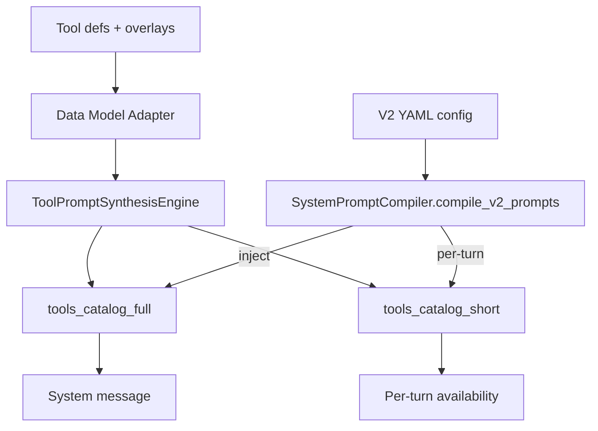

### Tool‑Prompt Synthesis Layer (TPSL) – Port Plan and Spec (Intermediate Plan)

This augments the V2 schema to externalize tool availability prompts and dialect instructions as evolvable templates, compiled at runtime. It is non‑breaking and interposes between prompts and dialects.

### Table of Contents
- [Objectives](#objectives)
- [Schema Delta](#schema-delta)
- [Directory Layout](#directory-layout)
- [Runtime Integration](#runtime-integration)
- [Milestones](#milestones)
- [Tests](#tests)
- [Mermaid: Data Flow](#mermaid-data-flow)

### Objectives
- Decouple tool catalog/dialect instructions from code into templates.
- Enable per‑dialect templates and detail tiers with caching and evolution.
- Preserve existing behavior when disabled.

### Schema Delta
Append to V2 without breaking existing keys.

prompts:
  tool_prompt_synthesis:
    enabled: true
    dialects:
      pythonic:
        system_full: implementations/tool_prompt_synthesis/pythonic/system_full.j2.md
        per_turn_short: implementations/tool_prompt_synthesis/pythonic/per_turn_short.j2.md
      unified_diff:
        system_full: implementations/tool_prompt_synthesis/unified_diff/system_full.j2.md
      aider:
        system_full: implementations/tool_prompt_synthesis/aider/system_full.j2.md
      anthropic_xml:
        system_full: implementations/tool_prompt_synthesis/anthropic_xml/system_full.j2.md
      harmony:
        system_full: implementations/tool_prompt_synthesis/harmony/system_full.j2.md
        render_with_library: false
    selection:
      by_model:
        "openrouter/openai/*": pythonic
        "anthropic/*": anthropic_xml
      by_mode:
        plan: pythonic
        build: unified_diff
    detail:
      system: full
      per_turn: short
    evolution:
      enabled: true
      mutable_blocks: ["guardrails.md","call_intro.md","examples/*"]
      frozen_blocks: ["_partials/signature_pydef.j2","_partials/result_entry_pydef.j2"]

### Directory Layout
implementations/tool_prompt_synthesis/
  common/
    filters.json
  pythonic/
    system_full.j2.md
    per_turn_short.j2.md
    _partials/
      signature_pydef.j2
      result_entry_pydef.j2
      call_intro.md
      guardrails.md
  unified_diff/
    system_full.j2.md
  aider/
    system_full.j2.md
  anthropic_xml/
    system_full.j2.md
  harmony/
    system_full.j2.md

### Runtime Integration
- Compiler: add ToolPromptSynthesisEngine (TPSL). When enabled, render `tools_catalog_full` for system injection and `tools_catalog_short` for per‑turn, using selection rules.
- Dialects: no change required; existing text generation is replaced by TPSL output when enabled.
- Provider adapters: if `harmony.render_with_library=true`, bypass TPSL text for Harmony.
- Telemetry: log `tpsl_template_id`, `dialect_id`, `detail` per turn.

### Milestones
1) Engine skeleton and schema read (M2.5)
   - Implement `ToolPromptSynthesisEngine` with sandboxed Jinja subset (no eval/imports), data model adapter, and cache key integration.
   - Wire into `SystemPromptCompiler.compile_v2_prompts` behind `prompts.tool_prompt_synthesis.enabled`.

2) Templates bootstrap
   - Provide minimal pythonic and unified_diff templates and partials.
   - Add `filters.json` with allowed filters and unit coverage.

3) Selection + detail
   - Respect by_model/by_mode selection and detail tiers.
   - Add fallback to legacy when template missing.

4) Telemetry + caching
   - Extend cache key to include TPSL template hashes.
   - Emit telemetry fields.

5) Tests and validation
   - Unit: render small toolsets; assert signatures, diff add‑file guidance, and cache stability.
   - Integration: ensure `compile_v2_prompts` injects catalogs when enabled; disabled path unchanged.

### Tests
- tests/tpsl/test_engine_render_basic.py
- tests/tpsl/test_compiler_integration.py
- tests/tpsl/test_selection_and_detail.py

### Mermaid: Data Flow

