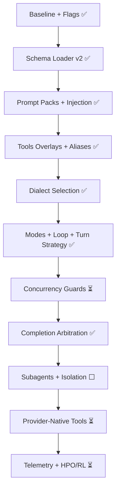

### Agent Schema V2 Port Plan — Current Status (01)

This document snapshots the implementation status of the V2 port plan across the codebase.

### Table of Contents
- [Overview](#overview)
- [Milestone-by-Milestone Status](#milestone-by-milestone-status)
- [Key Changes Landed](#key-changes-landed)
- [Remaining Gaps and Next Steps](#remaining-gaps-and-next-steps)
- [Test Status](#test-status)
- [Mermaid Roadmap (Status)](#mermaid-roadmap-status)

### Overview
- Scope: Implement Agent Schema V2 end-to-end (config, prompts, tools, loop/modes, selection, concurrency, completion, telemetry) while preserving legacy compatibility.
- Current state: Core milestones M0–M5 and M7 completed; M6/M9/M10 partially complete; M8 not started.

### Milestone-by-Milestone Status
- Milestone 0: Baseline and Flags — completed
  - `--schema-v2` flag in CLI; V2 loader toggle in agent bootstrap.

- Milestone 1: Schema Loader and Validation — completed
  - `compilation/v2_loader.py` with `extends` resolution, validation, normalization. Unit tests added.

- Milestone 2: Prompt Packs and Injection — completed
  - `SystemPromptCompiler.compile_v2_prompts` supports V2 packs, injection, cache keys; Tool Prompt Synthesis Layer (TPSL) integrated.

- Milestone 3: Tools Registry Overlays and Aliases — completed
  - Overlays (rename/description/syntax/provider preferences) and aliases applied without editing base YAML; tests added.

- Milestone 4: Dialect Selection and Fallback Policy — completed
  - Enhanced selection already existed; added V2 selection ordering in `OpenAIConductor` honoring `tools.dialects.selection.by_model` and `by_tool_kind` with diff-first behavior.
  - `create_file_policy` implemented: (1) udiff `/dev/null` header normalization; (2) Aider S/R create-file prefers direct write.
  - Targeted tests added.

- Milestone 5: Modes, Loop, and Turn Strategy — completed
  - Mode resolution, tool gating, and turn strategy wiring (relay/flow/tool result handling) are in place.

- Milestone 6: Concurrency Guards — partial
  - Present: one-bash-per-turn, nonblocking concurrency for native calls, initial barrier/group mapping extraction.
  - Gaps: strict enforcement across all paths for `barrier_after`, groups, and `at_most_one_of` with additional tests.

- Milestone 7: Completion Arbitration — completed
  - `CompletionDetector` combines tool-finish, provider signals, text sentinels; confidence threshold respected. Tests added.

- Milestone 8: Subagents and Isolation — not started
  - No supervisor/child-agent orchestration yet (sequential/parallel/hierarchical), nor isolated sub-workspaces.

- Milestone 9: Provider-Native Tools Integration — partial
  - Routing and prompt-mode arbitration in place with tests; basic native-tool execution path for OpenAI.
  - Gaps: deeper Anthropic/Google adapters, richer schema translation, more E2E native-tool coverage.

- Milestone 10: Telemetry + HPO/RL Integration — partial
  - `TelemetryLogger` and per-turn metrics plumbing exist; HPO/RL config stubs present.
  - Gaps: real sweeps (e.g., W&B), policy learning/evolution wiring.

### Key Changes Landed
- Config V2: `v2_loader.py` (extends, validate, normalize); CLI v2 flag.
- Prompts V2: pack/injection/caching; TPSL templates and integration.
- Tools: overlays/aliases application; provider-native prompt mode arbitration.
- Selection: V2 `by_model`/`by_tool_kind` ordering; unified diff dialect updated to enhanced interface with legacy compatibility.
- Loop/Modes/Turn Strategy: explicit modes, relay/flow strategies, per-turn compilation.
- Concurrency: initial guardrails (one-bash-per-turn, nonblocking sets) and mapping extraction.
- Completion: hybrid arbitration with confidence threshold.
- Telemetry: JSONL logging hooks.

### Remaining Gaps and Next Steps
- Concurrency (M6):
  - Enforce `barrier_after` and `groups.max_parallel` in both native and text-based paths.
  - Enforce `at_most_one_of` across tool families; add targeted tests.

- Subagents (M8):
  - Implement supervisors (sequential/parallel/hierarchical) with `DevSandboxV2` and optional LSP attachments; add budget control and transcript merging.

- Provider-native (M9):
  - Expand Anthropic/Google adapters; stronger schema translation; more E2E tests that exercise provider-native tool results.

- Telemetry/HPO/RL (M10):
  - Wire sweeps (W&B), metrics dashboards, optional prompt evolution and policy learning feedback.

- LSP test gating: re-enable v2 LSP/deployment suites and fix any import path issues in Ray actors (currently gated for runtime stability).

### Test Status
- Current run: 90 passed, 87 skipped, 4 warnings (LSP-heavy suites gated via env; green otherwise).
- New tests added:
  - `tests/test_dialect_selection_v2.py` (by-model and by-tool-kind ordering).
  - `tests/test_create_file_policy.py` (udiff `/dev/null` normalization, Aider write preference).

### Mermaid Roadmap (Status)

