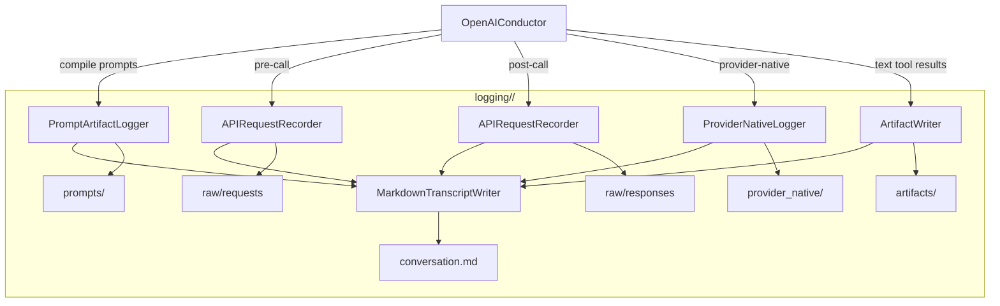

### Logging v2 Upgrade Plan

This plan scopes the next-generation debugging/logging module for agentic coding runs. It balances readability and fidelity by producing a clean human-readable transcript while offloading exact data into structured artifacts, all organized in a per-run directory under `logging/`.

### Table of Contents
- [Goals and Principles](#goals-and-principles)
- [Output Directory Layout](#output-directory-layout)
- [File Naming and Referencing Conventions](#file-naming-and-referencing-conventions)
- [Markdown Transcript Structure](#markdown-transcript-structure)
- [Raw Data Capture](#raw-data-capture)
- [Prompt Artifacts (TPSL + Compilation)](#prompt-artifacts-tpsl--compilation)
- [Configuration (Schema v2 additions)](#configuration-schema-v2-additions)
- [Module Design and Integration Points](#module-design-and-integration-points)
- [Testing Strategy](#testing-strategy)
- [Rollout and Risks](#rollout-and-risks)
- [Mermaid Overview](#mermaid-overview)

### Goals and Principles
- Produce a faithful but readable `.md` conversation transcript with granular, accurate headers and delimiters.
- Dump exact data (requests, responses, tool schemas, compiled prompts, tool results) into structured files; reference them from the transcript.
- Keep per-run logs isolated under `logging/<run_id>/` for easy archival and analysis.
- Support redaction of secrets and opt-in to raw dumps via config.
- Minimize impact on core loop by factoring logic into a dedicated logging package.

### Output Directory Layout
For each run, create a stable run directory `logging/<run_id>/` where `<run_id>` is `YYYYmmdd-HHMMSS_<session_id_short>`.

Within a run directory:
- `conversation/`
  - `conversation.md` — main readable transcript
  - `index.json` — summary manifest with pointers to primary artifacts
- `raw/`
  - `requests/turn_<n>.request.json`
  - `responses/turn_<n>.response.json`
  - `events/trace.jsonl` — optional event stream (compact, append-only)
- `prompts/`
  - `compiled_system.md` — compiled system prompt snapshot
  - `per_turn/turn_<n>.md` — per-turn appended availability prompts or cached snippets
  - `catalogs/<mode_or_hash>/` — bundled catalogs (TPSL templates rendered; manifest)
- `provider_native/`
  - `tools_provided/turn_<n>.json` — provider tool schema payloads
  - `tool_calls/turn_<n>.json` — provider-native tool calls (IDs, names, raw)
  - `tool_results/turn_<n>.json` — provider-native tool results with IDs and payload
- `artifacts/`
  - `tool_results/turn_<n>/<seq>_<tool_name>.txt` — summarized outputs
  - `diffs/turn_<n>/*.patch` — if extracted
- `meta/`
  - `run_meta.json` — run/session metadata (model, provider, config snippets)
  - `redaction.log` — optional report of redacted fields

### File Naming and Referencing Conventions
- All per-turn files are named with `turn_<n>` where `<n>` is 1-based.
- The transcript references artifacts using relative paths and clear labels (e.g., `See raw/requests/turn_3.request.json`).
- For compiled prompt catalogs, include a `catalog_manifest.json` in each catalog folder with `{ name, hash, dialect, files }`.

### Markdown Transcript Structure
`conversation/conversation.md` is the primary human-readable file. Each turn contains semantically precise headers:
- `**System**` — system prompt content (if changed this turn) and link to `prompts/compiled_system.md`.
- `**User**` — user content.
- `**Tools Available Prompt (Temporarily Appended to User Message)**` — readable summary; link to `prompts/per_turn/turn_<n>.md`.
- `**Tools Provided via Provider API Tool Schema**` — lists tool IDs; link to `provider_native/tools_provided/turn_<n>.json`.
- `**Model Called Provider Schema-Native Tools**` — lists each tool with ID and parameters; link to `provider_native/tool_calls/turn_<n>.json`.
- `**Provider Schema-Native Tool Call Results**` — lists tool name, provider ID, status/result (summarized); link to `provider_native/tool_results/turn_<n>.json`.
- `**Assistant**` — assistant text content (if any), separate from native-tool result relay sections.
- `**Tool Results (Text-Based Execution)**` — our prompt-schema tool results summary; per-tool links to `artifacts/tool_results/...`.

Additional notes:
- When a tools-availability prompt is appended temporarily, mark it explicitly; if system prompt is recomputed or cached, state it and link to artifacts.
- When provider-native is in effect, separate native sections from text-based tool sections.

### Raw Data Capture
- Capture each API request/response as a raw JSON file with full payload (model, params, messages, tool schema provided, response object), subject to redaction rules.
- Append minimal turn-scoped trace entries to `raw/events/trace.jsonl` (e.g., `{"ts": ..., "event": "request", "turn": n, "path": "raw/requests/..."}`) for rapid navigation.

### Prompt Artifacts (TPSL + Compilation)
- On compilation, persist the compiled system prompt and per-turn availability to `prompts/`.
- For TPSL catalogs, render to `prompts/catalogs/<dialect_or_hash>/` and write a `catalog_manifest.json` with pointers.
- The transcript links to these files instead of inlining large blobs.

### Configuration (Schema v2 additions)
Under the V2 config, add a `logging` section (defaults shown):
```
logging:
  enabled: true
  root_dir: logging
  redact: true
  include_raw: true
  include_events: true
  retention:
    max_runs: 50
  filename_scheme: timestamp_session
```
Notes:
- `redact`: scrub API keys, access tokens, and known secret envs from raw artifacts.
- `include_raw`: toggle raw request/response dumps.
- `include_events`: toggle trace.jsonl.
- `retention`: optional cleanup policy on start/end.

### Module Design and Integration Points
New package: `agentic_coder_prototype/logging_v2/`
- `run_logger.py` — LoggerV2Manager
  - Creates run directory; manages path building; writes manifests and meta; applies redaction.
- `markdown_transcript.py` — MarkdownTranscriptWriter
  - Append turn sections with accurate headers; inject links to artifacts; small, readable summaries.
- `artifact_writer.py` — ArtifactWriter
  - Writes JSON/MD/text files; ensures deterministic formatting; handles retention.
- `api_recorder.py` — APIRequestRecorder
  - Saves raw request/response payloads per turn; emits event entries.
- `prompt_logger.py` — PromptArtifactLogger
  - Hooks into compilation; persists compiled prompts and TPSL catalogs; writes manifests.
- `provider_native_logger.py` — ProviderNativeLogger
  - Persists provider tool schema offered, native tool calls and results.
- `redaction.py` — Redactor
  - Filtering of sensitive keys and environments.

Integration points:
- `agent_llm_openai.py`
  - Initialize LoggerV2Manager at run start; pass config.
  - Before API call: APIRequestRecorder.save_request(turn_n, payload), link path into transcript.
  - After API call: APIRequestRecorder.save_response(turn_n, payload), link.
  - When compiling prompts: PromptArtifactLogger.persist(...), append transcript links.
  - When building per-turn tools availability: write per-turn MD artifact and link.
  - While handling provider-native tool calls/results: ProviderNativeLogger writes JSON artifacts; transcript adds dedicated sections with IDs and short YAML/JSON snippets.
  - When formatting tool results (text-based): place summarized results under `artifacts/tool_results/` and link.
- `system_prompt_compiler.py`
  - Expose callback/return paths to persist compiled outputs via PromptArtifactLogger without coupling.
- `MessageFormatter`
  - Update to support new headings and link insertion helpers from MarkdownTranscriptWriter.

### Testing Strategy
- Unit tests (no network):
  - Directory creation and manifest writing; redaction logic.
  - Transcript sections presence (headers, link references) for synthetic turns.
  - Prompt artifact persistence and manifest.
  - Provider-native logging with stubbed calls/results.
- Integration tests:
  - Minimal agent run writes expected tree under `logging/<run_id>/`.
  - Validate cross-file links (relative paths) resolve.

### Rollout and Risks
- Roll out under `logging.enabled` flag; keep legacy `.md`/`.json` until parity confirmed.
- Risk: log volume — mitigate via config toggles and retention policy.
- Risk: secret leakage — default redaction on; maintain allowlist/denylist.

### Mermaid Overview



